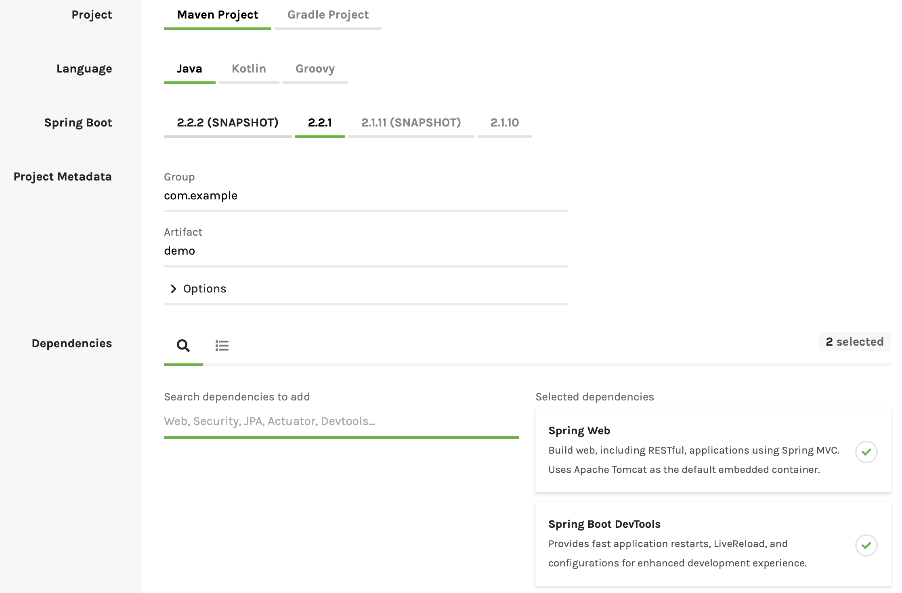
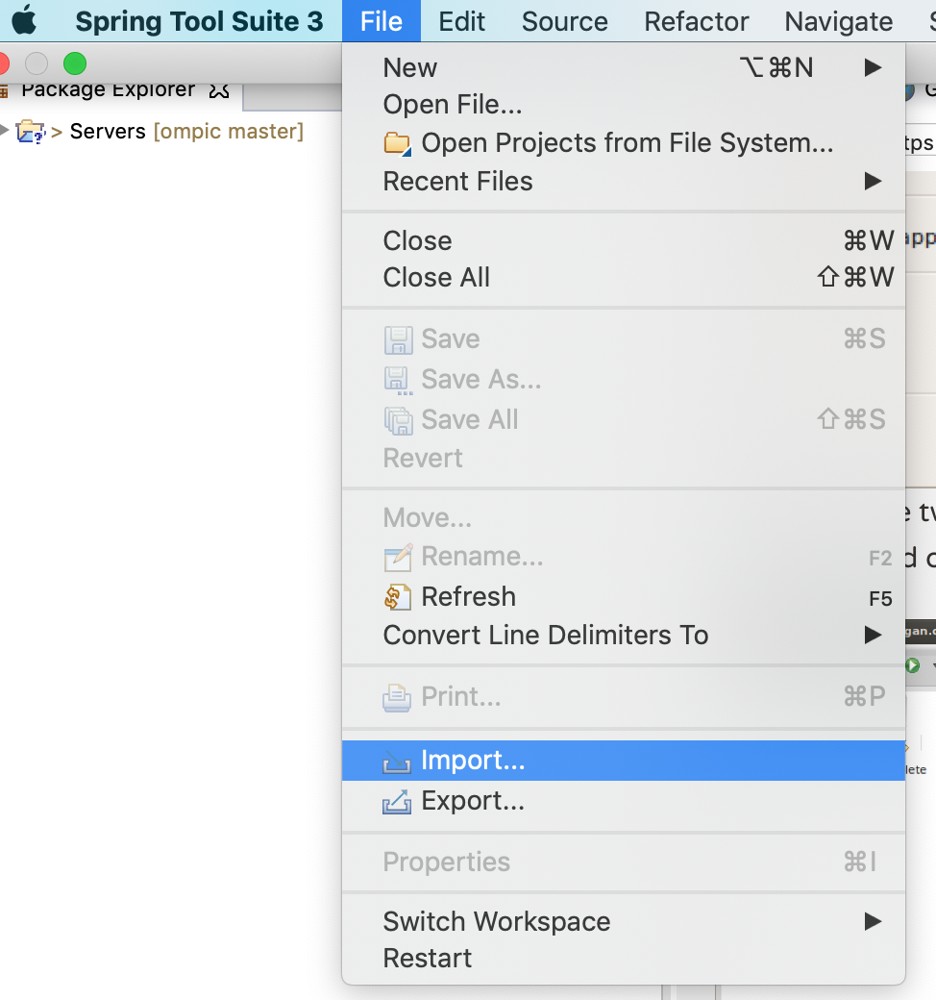
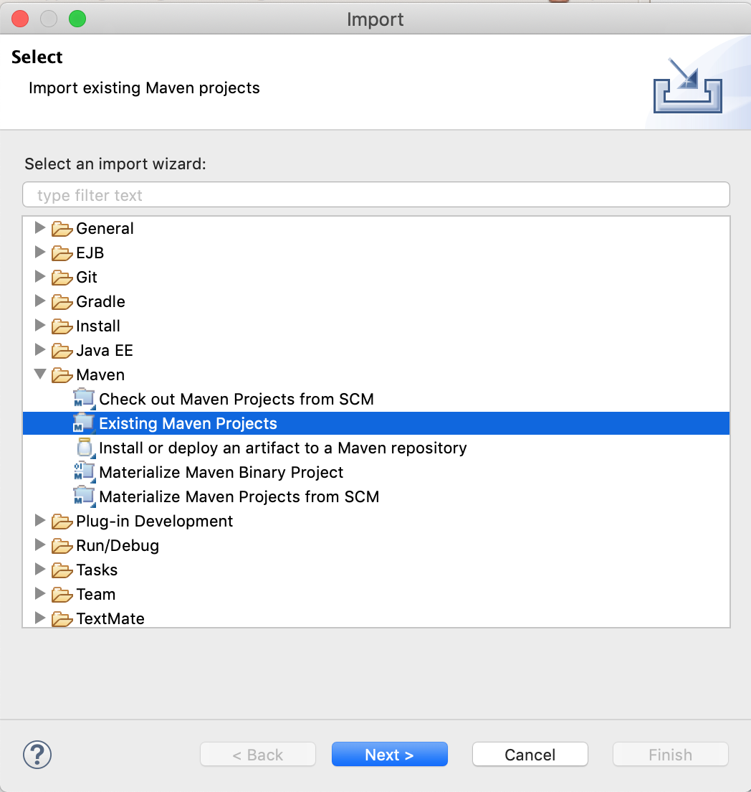
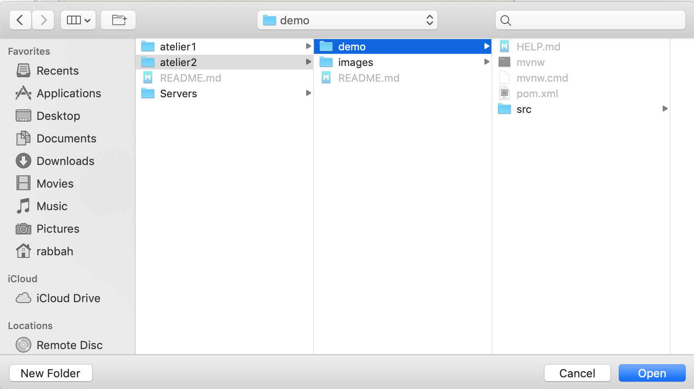
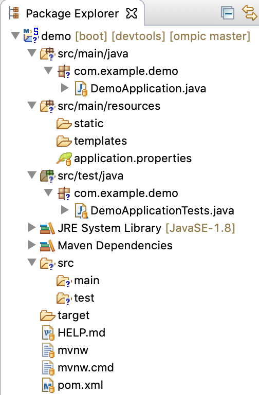
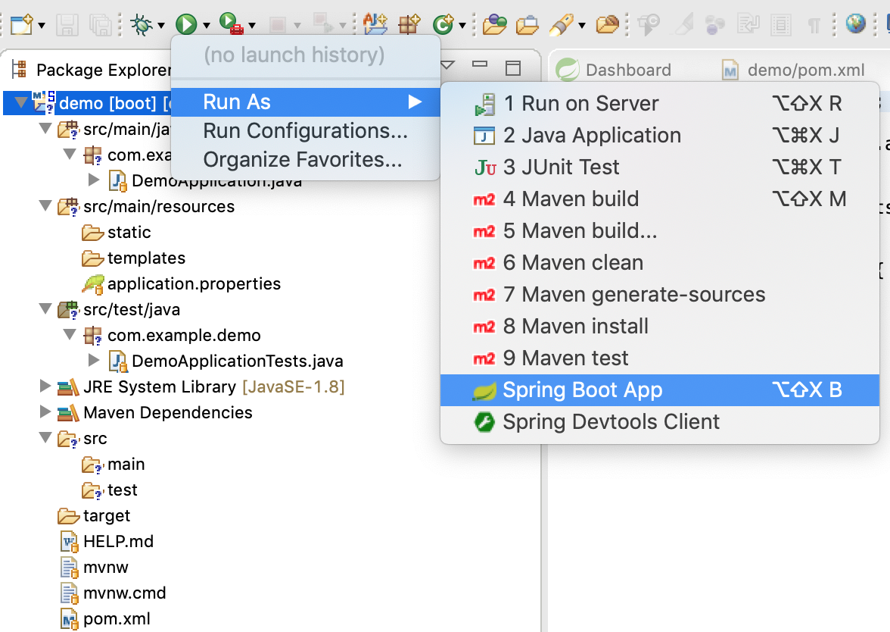
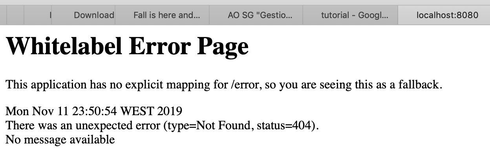
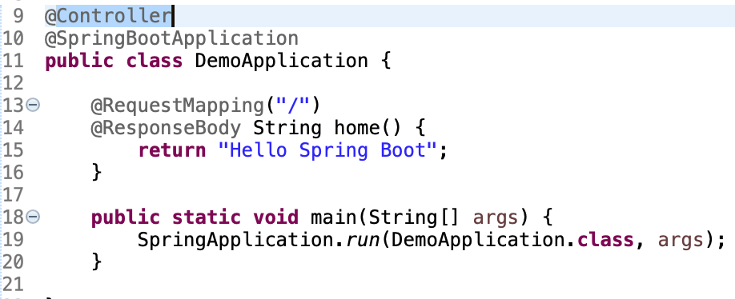
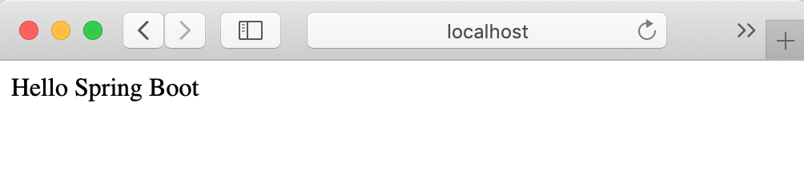

# Ma première application SPRING BOOT

## Création du projet

1. Allez vers le lien : [https://start.spring.io](https://start.spring.io)
2. Créer un projet Maven avec les paramètres suivantes:

3. Cliquez sur "Generate"
4. Dé-zippez le fichier demo.zip
5. Déposez le dossier demo dans le workspace STS

## Explication de l'utilité de Devtools
Devtools est un outil qui permet d'auto-configurer l'environnement de développement ceci via:

* Property Defaults: certaines configurations faites par spring boot automatiquement peuvent ne pas être adéquates avec l'environnement de développement ex: activation du cache des pages web "thymeleaf", en ajoutant Devtools spring boot désactive ce cache automatiquement pour vous.
* Automatic Restart: Redémarrage automatique de Tomcat après changement du code.
* Live Reload: rechargement automatique de page web après changement du code (ceci suppose que le plugin LiveReload est installé sur votre browser)
* ...

## Importation du projet sur STS
1. Ouver STS
2. Importer le projet en suivant les étapes illustrées suivantes:

## Analyse et exécution du projet
* Analyse de l'arborescance:

* Execution:

* Accéder à [http://localhost:8080](http://localhost:8080)

Oooops!

* Créer une Request Mapping

* Remarquez: après enregistrement du projet l'application va être re-déployer automatiquement

Voilà!

