# Comprendre l'Auto-Configuration

## L'injection de dépendance

1. Créer un nouveau projet Spring Boot sur STS
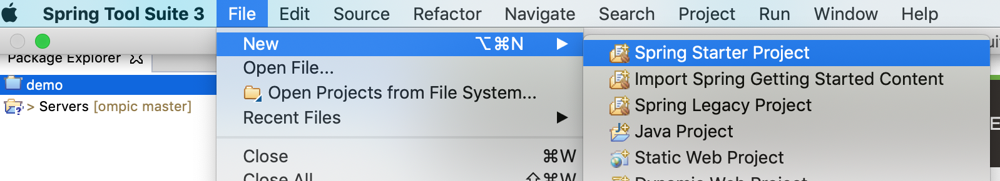
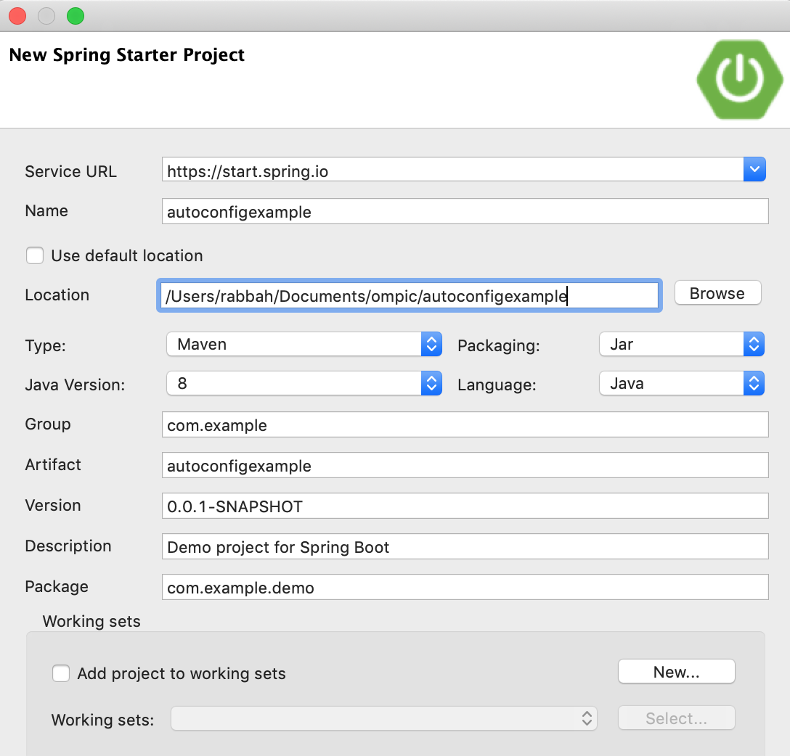
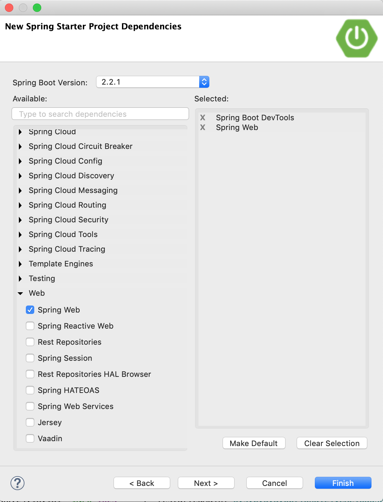

2. Créer un package **services** sous le package principal:
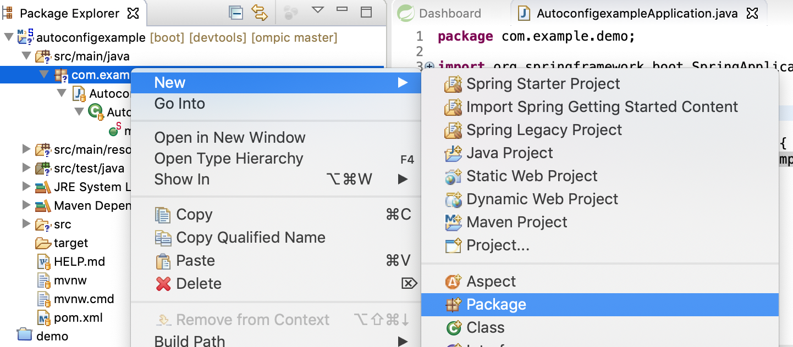
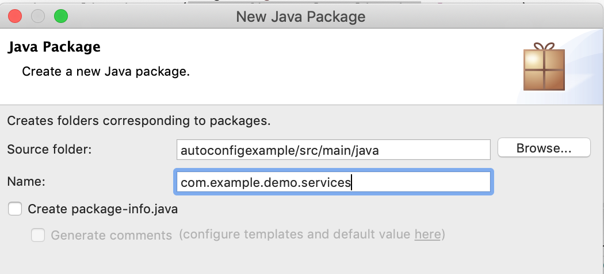

3. Créer une class **MyService** dans le package services
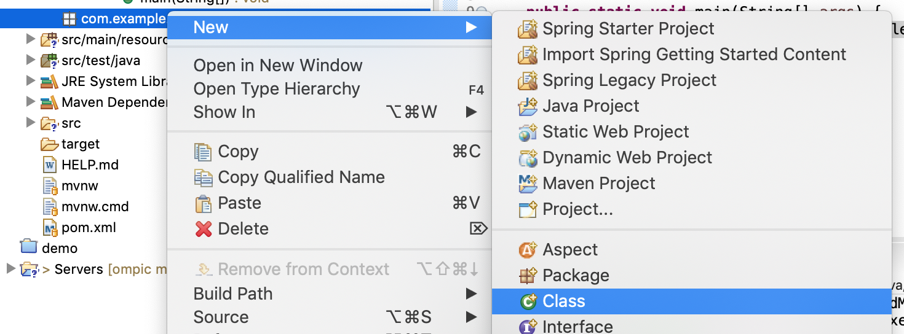
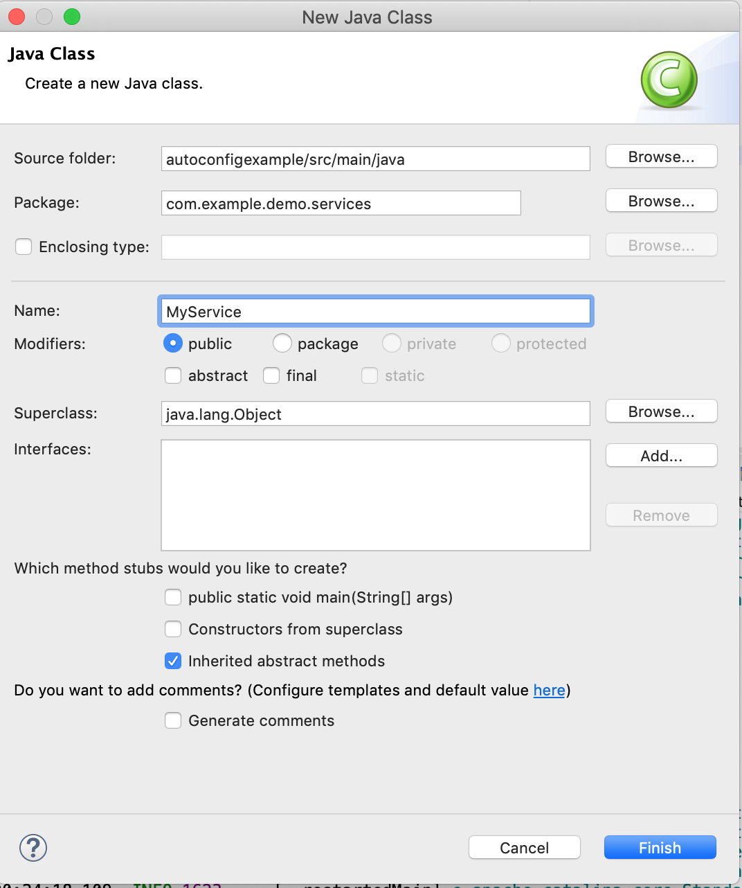

4. Changer la class comme suite:
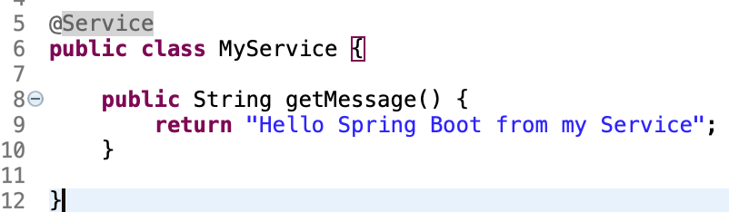

5. Changer la class **AutoconfigexampleApplication** de telle sort à ce qu'elle devienne un controlleur, et injecte le service MyService et répond au Requête sur la racine "/" avec le message provenant du service:
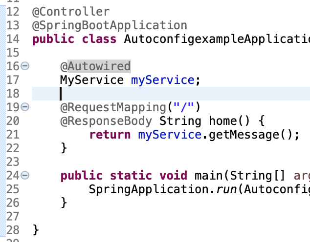

6. Exécuter le projet:


**Remarquez que sans déclarer le Bean MyService et sans explicitement injecter ce service dans le controller vous avez pu l'utiliser car vous êtes dans le même package et vous respecter le standard!**

## Personnaliser l'Auto-Configuration
Le serveur Tomcat se lance par défaut sur le port 8080 (c'est une auto configuration faite par Spring Boot), mais si on veut changer le port par défaut comment faire?

1. Allez sur le [lien suivante](https://docs.spring.io/spring-boot/docs/current/reference/html/appendix-application-properties.html)
2. Cliquez au niveau du menu gauche sur **Server properties**
3. Cherchez comment changer le port
4. Changer le fichier application.properties dans votre projet comme suit:
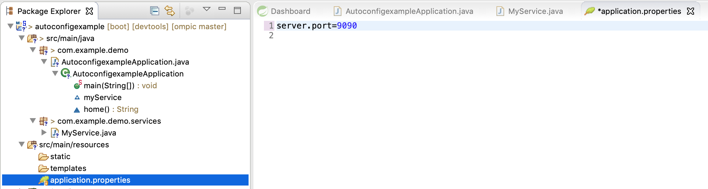

5. Ouvrez le browser sur le lien suivant: [http://localhost:9090](http://localhost:9090)
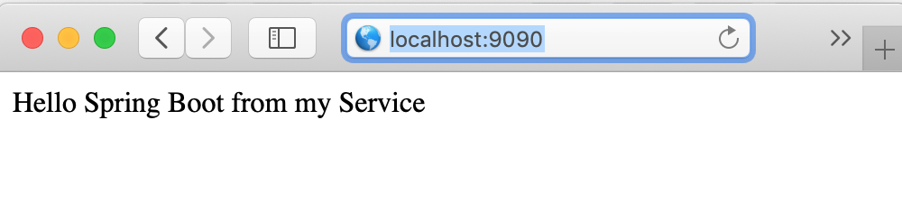

# SPRING DATA JPA
Dans cette partie nous allons manipuler des données qui proviennent d'une Base de donnée avec **Spring DATA** et **JPA**

1. Arrêtez l'application en cours d'exécution
2. Ajouter les starter **spring-boot-starter-data-jpa** 
et **h2** au niveau de votre **pom.xml**
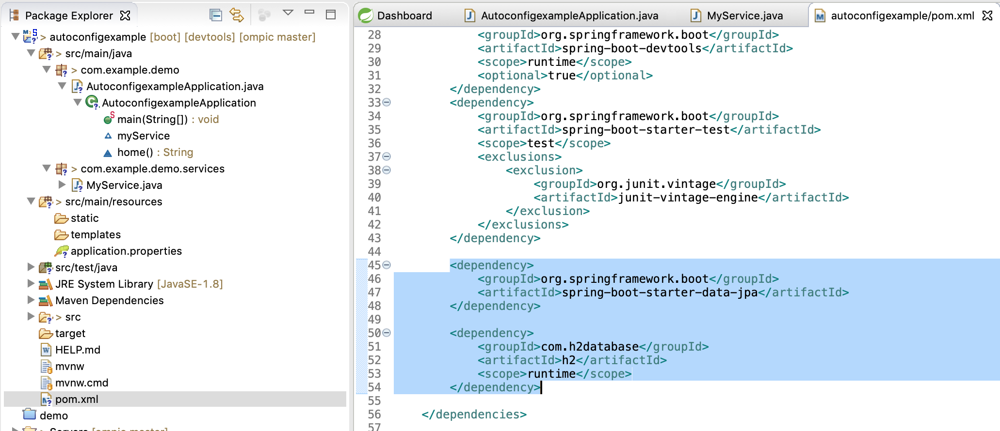

	```
	<dependency>
		<groupId>com.h2database</groupId>
		<artifactId>h2</artifactId>
		<scope>runtime</scope>
	</dependency>
	<dependency>
		<groupId>org.springframework.boot</groupId>
		<artifactId>spring-boot-starter-data-jpa</artifactId>
	</dependency>
	```
3. Créer le package **entities**
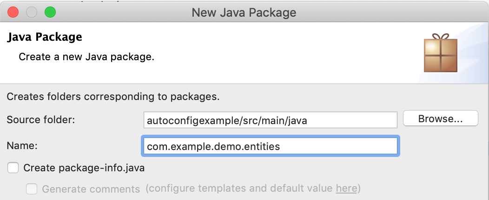

4. Dans ce package créer l'entité: **Customer** comme suit:
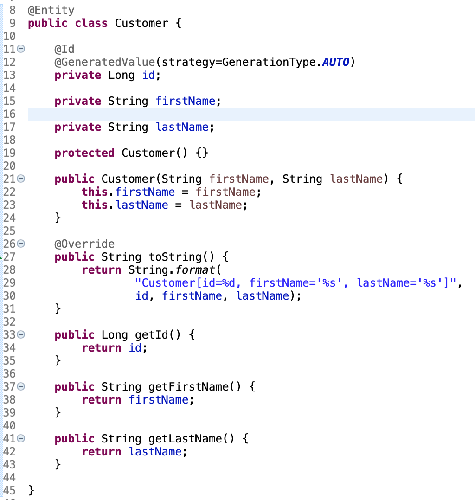

	```java
	package com.example.demo.entities;

	import javax.persistence.Entity;
	import javax.persistence.GeneratedValue;
	import javax.persistence.GenerationType;
	import javax.persistence.Id;
	
	@Entity
	public class Customer {
	
		@Id
	    @GeneratedValue(strategy=GenerationType.AUTO)
	    private Long id;
		
	    private String firstName;
	    
	    private String lastName;
	
	    protected Customer() {}
	
	    public Customer(String firstName, String lastName) {
	        this.firstName = firstName;
	        this.lastName = lastName;
	    }
	
	    @Override
	    public String toString() {
	        return String.format(
	                "Customer[id=%d, firstName='%s', lastName='%s']",
	                id, firstName, lastName);
	    }
	
		public Long getId() {
			return id;
		}
	
		public String getFirstName() {
			return firstName;
		}
	
		public String getLastName() {
			return lastName;
		}
		
	}

	```
5. Dans le même package créer une interface CustomerRepository:
	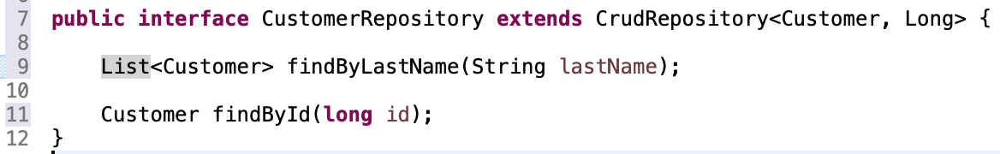
	
	```	java
		package com.example.demo.entities;

		import java.util.List;
		
		import org.springframework.data.repository.CrudRepository;
		
		public interface CustomerRepository extends CrudRepository<Customer, Long> {
		
		    List<Customer> findByLastName(String lastName);
		
			Customer findById(long id);
		}
			
	```
**Remarquez on n'a pas besoin d'implémenter l'interface ce qui fait la force de SPRING DATA!**
6. Changant maintenant le service pour qu'il fasse appel au repository jadis déclaré:
	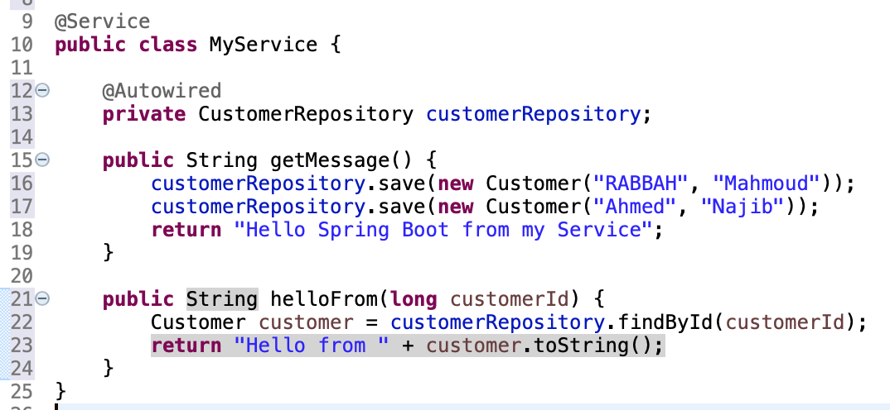

	```	java
	package com.example.demo.services;

	import org.springframework.beans.factory.annotation.Autowired;
	import org.springframework.stereotype.Service;
	
	import com.example.demo.entities.Customer;
	import com.example.demo.entities.CustomerRepository;
	
	@Service
	public class MyService {
		
		@Autowired
		private CustomerRepository customerRepository;
		
		public String getMessage() {
			customerRepository.save(new Customer("RABBAH", "Mahmoud"));
			customerRepository.save(new Customer("Ahmed", "Najib"));
			return "Hello Spring Boot from my Service";
		}
	
		public String helloFrom(long customerId) {
			Customer customer = customerRepository.findById(customerId);
			return "Hello from " + customer.toString();
		}
	}
	```	
7. Maintenant ajouter un URL Mapping **/hellofrom** Dans le controlleur:
	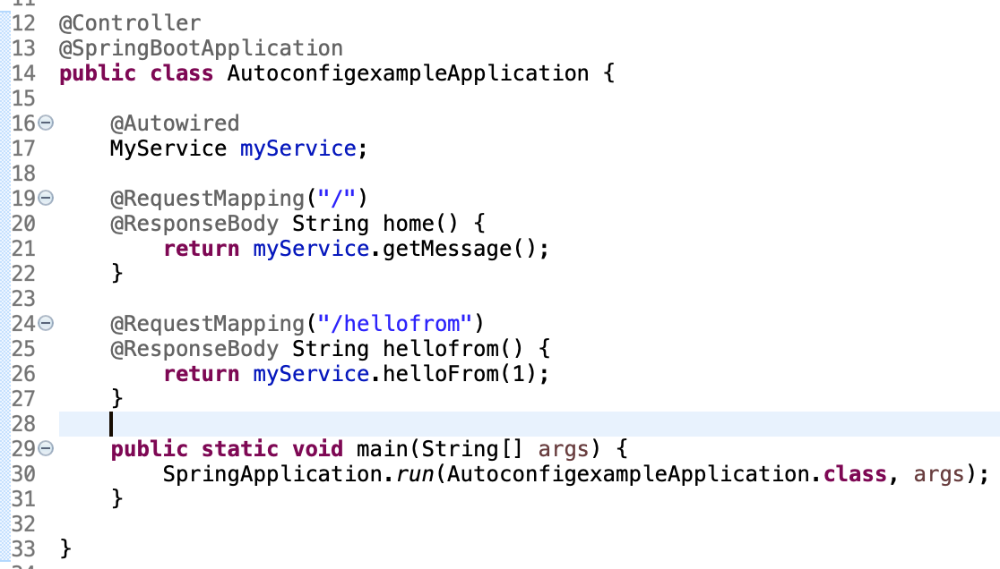
	
	```java
	package com.example.demo;

	import org.springframework.beans.factory.annotation.Autowired;
	import org.springframework.boot.SpringApplication;
	import org.springframework.boot.autoconfigure.SpringBootApplication;
	import org.springframework.stereotype.Controller;
	import org.springframework.web.bind.annotation.RequestMapping;
	import org.springframework.web.bind.annotation.ResponseBody;
	
	import com.example.demo.services.MyService;
	
	@Controller
	@SpringBootApplication
	public class AutoconfigexampleApplication {
	
		@Autowired
		MyService myService;
		
		@RequestMapping("/")
		@ResponseBody String home() {
			return myService.getMessage();
		}
		
		@RequestMapping("/hellofrom")
		@ResponseBody String hellofrom() {
			return myService.helloFrom(1);
		}
		
		public static void main(String[] args) {
			SpringApplication.run(AutoconfigexampleApplication.class, args);
		}
	
	}

	```
8. Exécuter le projet et naviger vers [http://localhost:9090/](http://localhost:9090/)
**Remarquez que lors de l'appel de cette URL, il va y avoir l'enregistrement au niveau de la BdD H2 de deux Customers**
9. Maintenant changez l'URL vers [http://localhost:9090/hellofrom](http://localhost:9090/hellofrom)
	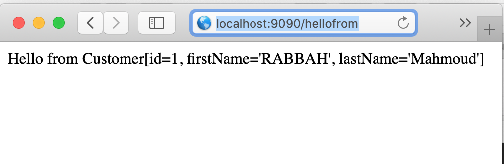
**Félicitation vous venez d'utiliser SPRING DATA et JPA avec succès!**
10. Pour vous connectez à la BdD H2 ajoutez dans le fichier application.properties la valeur suivante:

	```
	spring.h2.console.enabled=true
	```
11. Redémarrez l'application, puis re-visiter l'URL [http://localhost:9090](http://localhost:9090) pour re-peupler la base **NB: lors du redémarrage de l'application on a perdu les anciens enregistrements car c'est une base juste en mémoire**
12. Par la suite allez vers l'URL [http://localhost:9090/h2-console](http://localhost:9090/h2-console)
	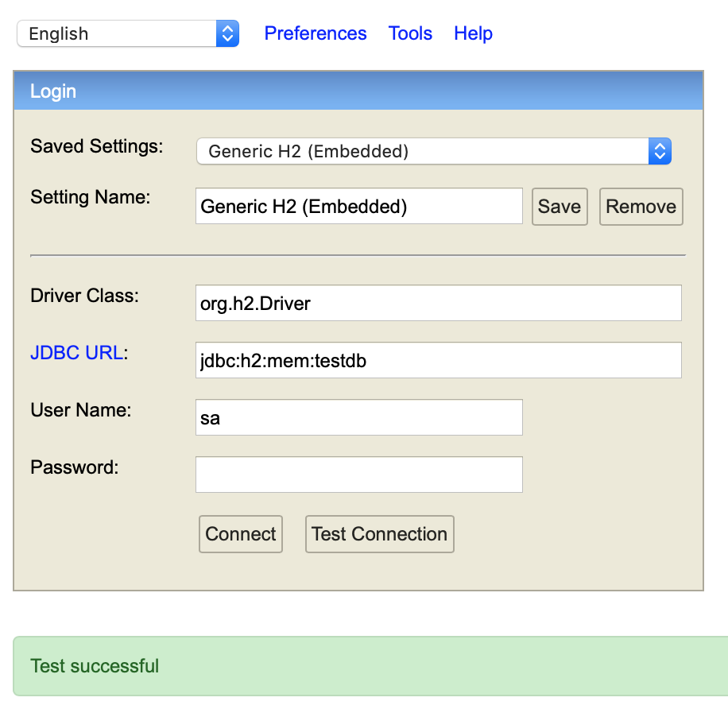
13. Cliquez sur Connect
	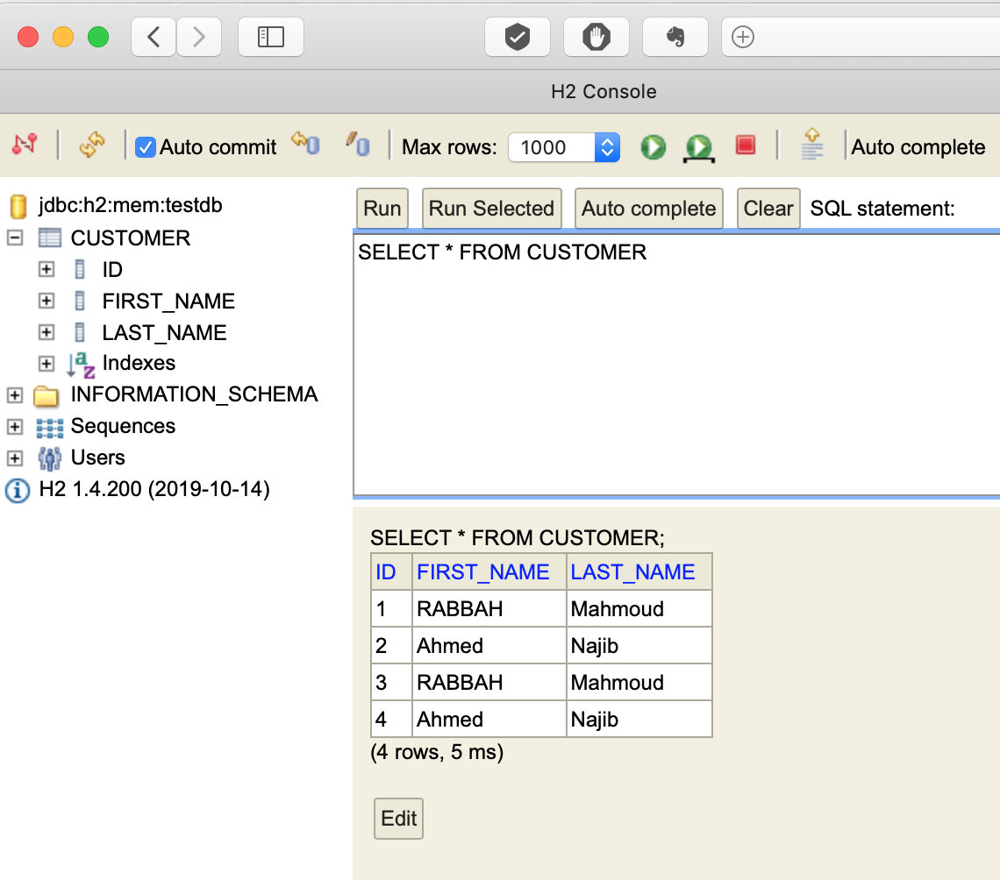


