# Les Beans et les Ressources

## Les Beans: L'injection de dépendance

1. Créer un nouveau projet Spring Boot sur STS

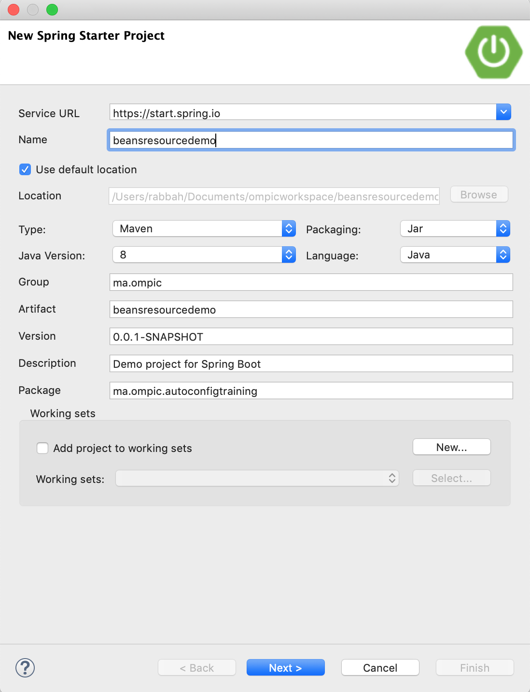


2. Créer les package **config**, **dto** et **controllers** sous le package principal:
	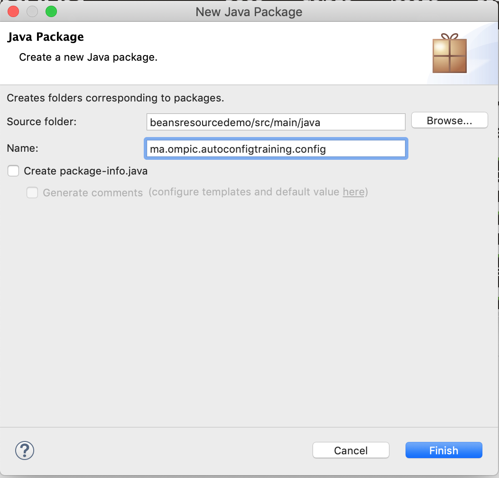

3. Créer une class **MyConfig** sous le package config et deux class **Company** et **Address** sous dto et la classe **MyController** sous le package controllers
	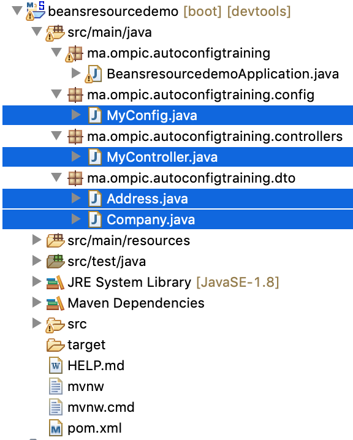

4. Changer les class Company et Address comme suit:

	```java
		package ma.ompic.autoconfigtraining.dto;
		
		public class Address {
		
			private String street;
			private int number;	
			
			public Address(String street, int number) {
				this.street = street;
				this.number = number;
			}
			public String getStreet() {
				return street;
			}
			public void setStreet(String street) {
				this.street = street;
			}
			public int getNumber() {
				return number;
			}
			public void setNumber(int number) {
				this.number = number;
			}
			
			@Override
			public String toString() {
				return "[ Street: " + this.street + ", Number: " + this.number + "]";
			}
			
		}

	```
	```java
	package ma.ompic.autoconfigtraining.dto;
	
	public class Company {
	
		private String name;
		
		private Address address;
	
		public Company(String name, Address address) {
			this.name = name;
			this.address = address;
		}
		
		public Company(Address address) {
			this.name = "DEFAULT";
			this.address = address;
		}
	
		public String getName() {
			return name;
		}
	
		public void setName(String name) {
			this.name = name;
		}
	
		public Address getAddress() {
			return address;
		}
	
		public void setAddress(Address address) {
			this.address = address;
		}
		
		@Override
		public String toString() {
			return "Company name: " + this.name + " address : " + this.address;
		}
		
	}

	```
	
5. Modifier la classe **MyConfig** de tel sorte à pouvoir la déclarer comme une classe de configuration, puis déclarer un bean de type Address:
	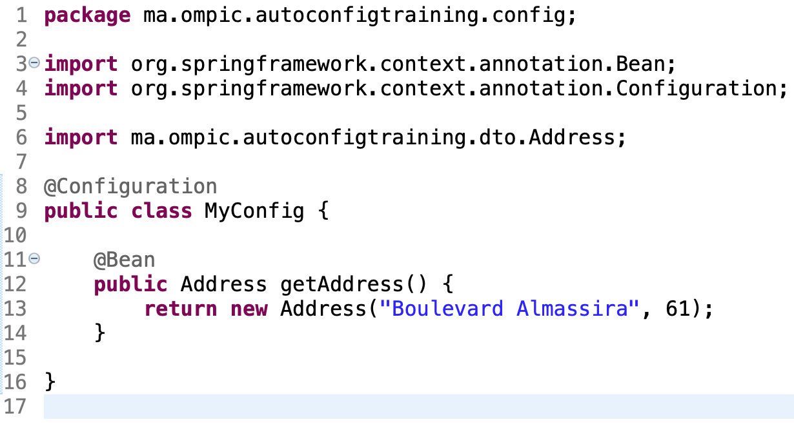

6. Modifier la class **MyController** de tel sorte à ce qu'elle demande à spring de lui injecter un bean de type **Company**, par la suite ce controller doit Mapper les demandes sur l'URL **"/"** vers une réponse contenant le nom de la Company et son adresse:
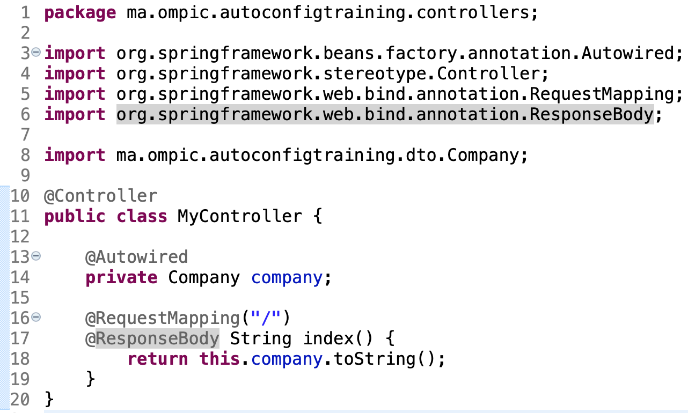

7. Lancer le projet:
		
	**C'est quoi le problème ???? Proposez des solutions pour le résoudre**

8. Ajouter l'annotation **@Component** à la class Company, et relancer le projet

	**Vous remarquez qu'il y a toujours un problème !!!**

9. Ajouter le constructeur par défaut à la class Company et relancer le projet
	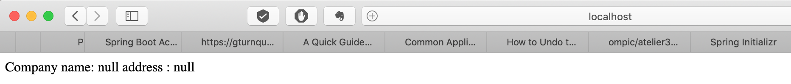

10. Ajouter l'annotation **@Autowired** à l'attribut address de la class Company
	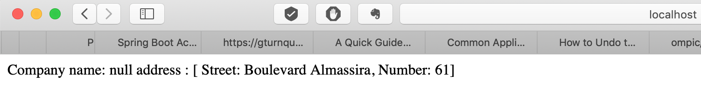

## Les Ressources

1. Créer deux fichiers properties au niveau du dosser **src/main/resources** à savoir **config.properties** et **my.properties**
	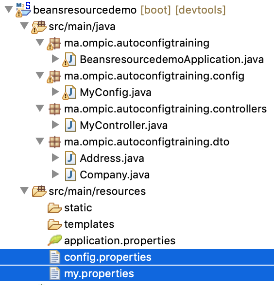

2. Dans le fichier my.properties ajouter la valeur suivante:
	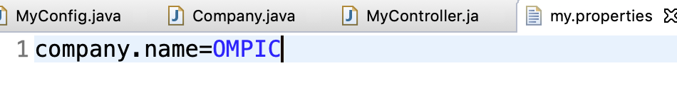

3. Revenez à la class Company et ajouter l'annotation **@PropertySource** en indiquant les chemins des fichiers properties récement créés, ensuite affecté la valeur se trouvant au niveau du fichier **my.properties** à l'attribut name:
	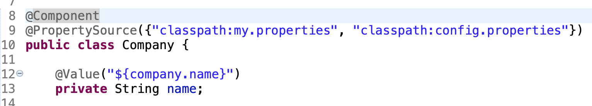

4. Remarquez le changement au niveau du browser:
	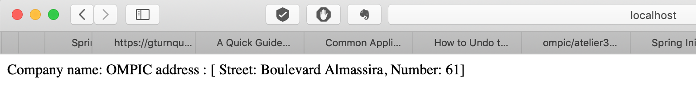
	
**Version finale de la class Company**

```java
package ma.ompic.autoconfigtraining.dto;

import org.springframework.beans.factory.annotation.Autowired;
import org.springframework.beans.factory.annotation.Value;
import org.springframework.context.annotation.PropertySource;
import org.springframework.stereotype.Component;

@Component
@PropertySource({"classpath:my.properties", "classpath:config.properties"})
public class Company {

	@Value("${company.name}")
	private String name;
	
	@Autowired
	private Address address;

	public Company(String name, Address address) {
		this.name = name;
		this.address = address;
	}

	public Company(Address address) {
		this.name = "DEFAULT";
		this.address = address;
	}
	
	public Company() {}
	
	public String getName() {
		return name;
	}

	public void setName(String name) {
		this.name = name;
	}

	public Address getAddress() {
		return address;
	}

	public void setAddress(Address address) {
		this.address = address;
	}
	
	@Override
	public String toString() {
		return "Company name: " + this.name + " address : " + this.address;
	}
	
}
```


