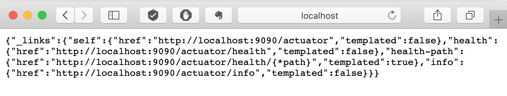
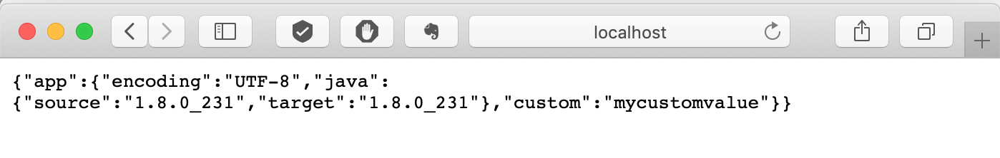
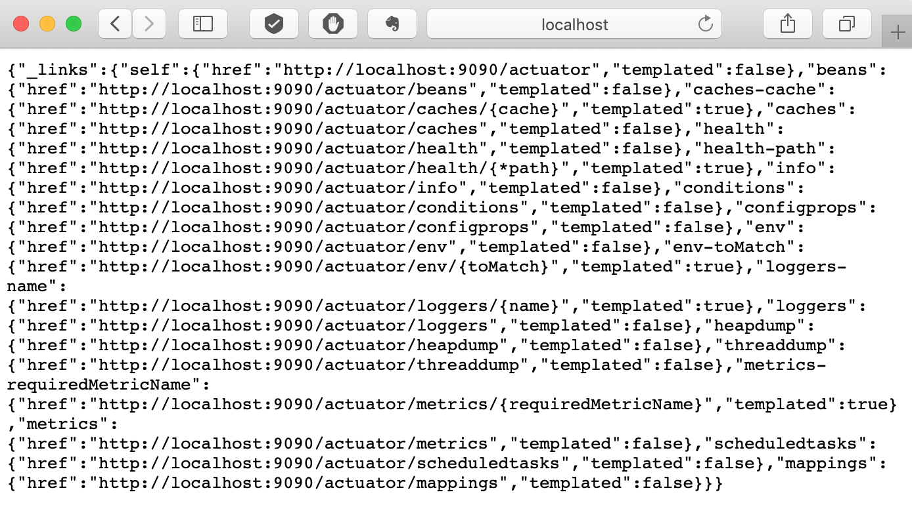
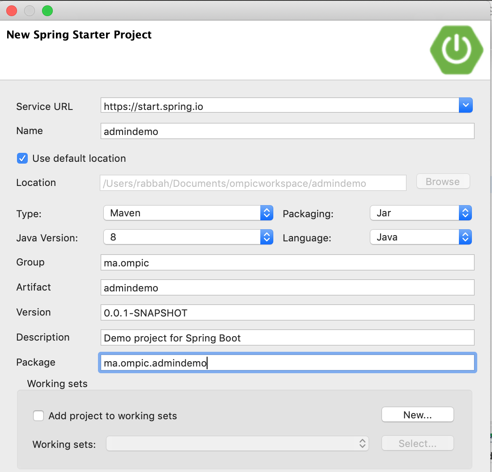
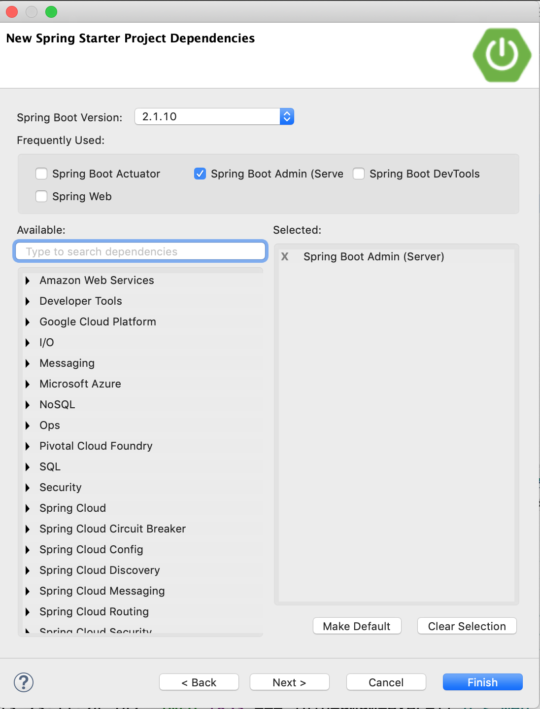
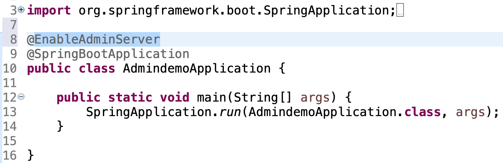
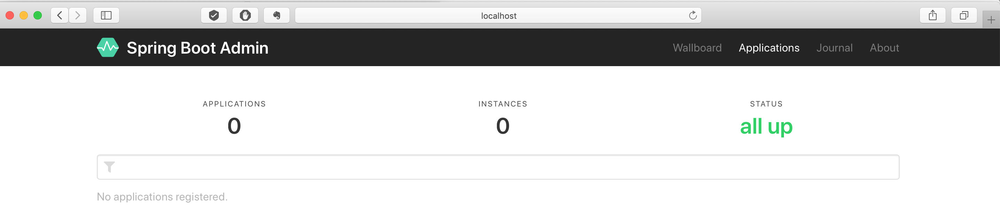
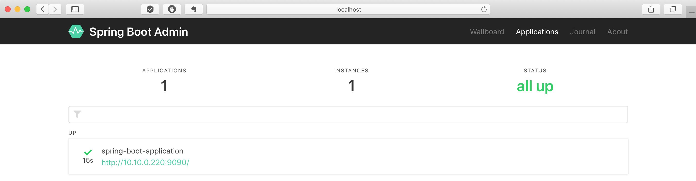
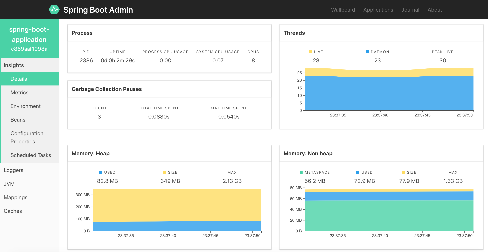

# Actutator / Spring Boot Admin

## Actuator

#### **Pré-requis: Ce projet nécessite que vous avez fait l'atelier 3 au préalable**

1. Ouvrez le projet créer lors de l'atelier 3 `autoconfigtraining`

2. Ajoutez la dépendance suivante:

	```xml
	<dependency>
			<groupId>org.springframework.boot</groupId>
			<artifactId>spring-boot-starter-actuator</artifactId>
	</dependency>
	```

3. Exécuter le projet et accéder à l'URL: [http://localhost:9090/actuator](http://localhost:9090/actuator)

	

4. Ouvrez les liens: [http://localhost:9090/actuator/health](http://localhost:9090/actuator/health) [http://localhost:9090/actuator/info](http://localhost:9090/actuator/info)
5. Pour avoir des informations plus significatives au niveau du endpoint info ajoutez au niveau du fichier application.properties les valeurs suivantes:

	```
	info.app.encoding=@project.build.sourceEncoding@
	info.app.java.source=@java.version@
	info.app.java.target=@java.version@
	```
	**Remarquez vous pouvez ajouter des informations personnalisées comme:**`info.app.custom=mycustomvalue`
	
6. Re-visitez l'URL: [http://localhost:9090/actuator/info](http://localhost:9090/actuator/info)
	

7. Pour exposer les autres EndPoints ajouter la valeur suivante au niveau du fichier application.properties `management.endpoints.web.exposure.include=*`
8. Consultez la liste des EndPoints exposés:
	

9. Essayer de consulter les différents EndPoints.

## Spring Boot Admin

1. Créer un nouveau projet nommé: admindemo comme suit:

	
	
	**Remarque: pour le moment Spring Boot Admin n'est pas supporté avec la version 2.2.X**

2. Ajouter l'Annotation `@EnableAdminServer` au niveau de la class `AdmindemoApplication`

	
	
3. Exécutez le projet et accédez à [http://localhost:8080](http://localhost:8080):

	
	
4. Déclarant le projet de l'atelier 3 comme client qui doit envoyer ces information au serveur Spring Boot Admin ceci en suivant les étapes suivantes:
	1. Ajoutez la dépendance suivante au projet de l'atelier 3:
	
		```
		<dependency>
		    <groupId>de.codecentric</groupId>
		    <artifactId>spring-boot-admin-starter-client</artifactId>
		    <version>2.1.6</version>
		</dependency>
		```
	2. Ajoutez au niveau application.properties les valeurs suivantes:
	
		```
		management.endpoint.health.show-details=always
		spring.boot.admin.client.url=http://localhost:8080
		```
	3. Relancer votre projet

5. Rafraîchir l'URL du serveur d'administration [http://localhost:8080](http://localhost:8080)

	
	
6. Visitez l'interface d'administration

	
	
## Allez plus loin: Etat de santé personnalisée

Dans cette partie nous voulons pouvoir dire que notre application est Down non seulement par rapport à l'état de son exécution, mais plutôt par rapport à des contraintes métiers (exemple table CUSTOMER est vide...)

1. Créer un package dans l'application de l'atelier 3 nommé `health`
2. Créer une class nommée `MyHealthIndicator` comme suit:

	```java
	import org.springframework.boot.actuate.health.Health;
	import org.springframework.boot.actuate.health.HealthIndicator;
	import org.springframework.stereotype.Component;
	
	@Component
	public class MyHealthIndicator implements HealthIndicator {
	
	    @Override
	    public Health health() {
	
	    	if (Math.random() < 0.5) {
	            return Health.down().withDetail("Error Code", 2400).build();
	        }
	        return Health.up().build();
	    }
	
	}
	```

3. Qu'est ce que vous remarquez au niveau du serveur d'administratio

### Exercie:

remplacez `Math.random() < 0.5` par une condition qui test si la Base de donnée ne contient pas de clients.

