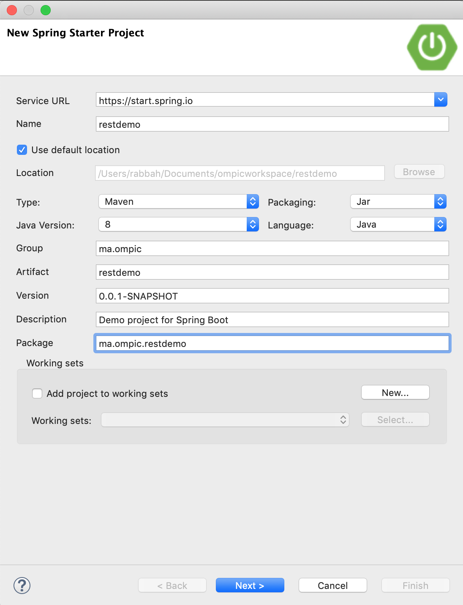
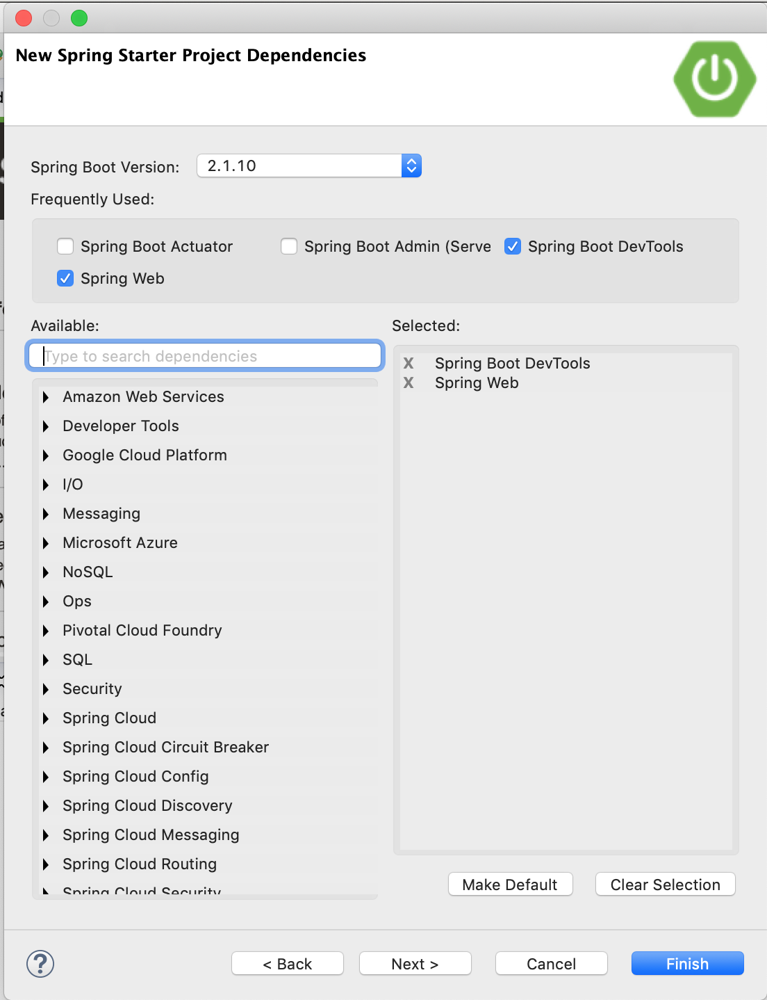
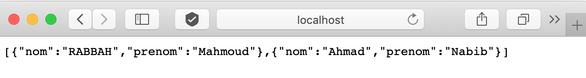
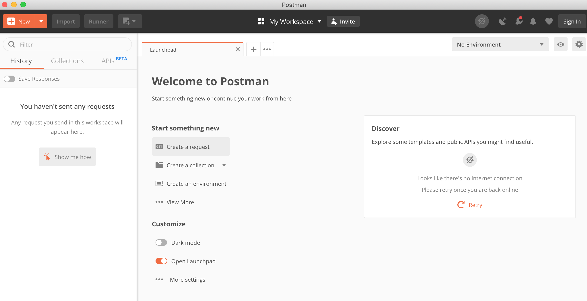
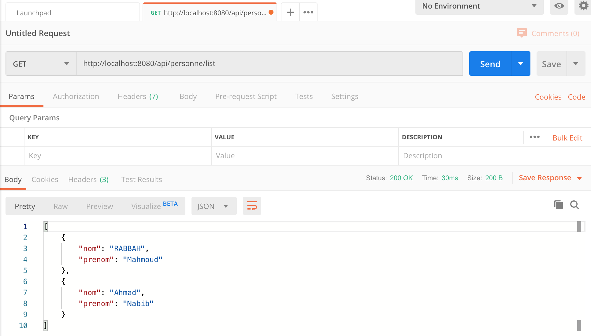
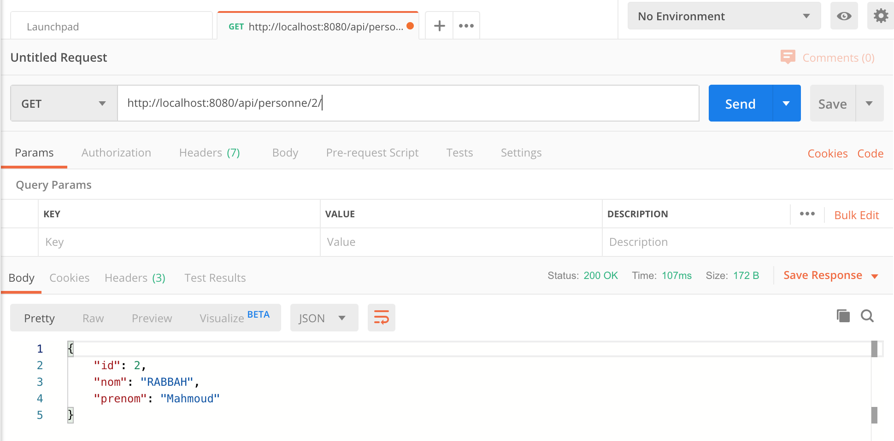
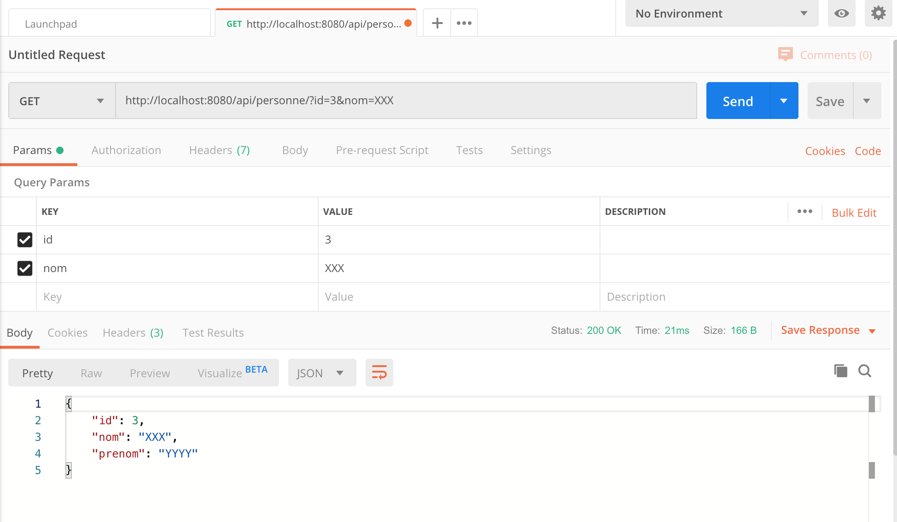
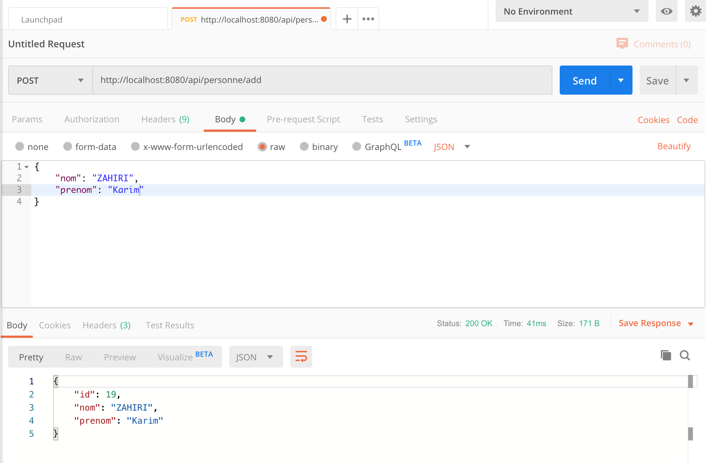

# SPRING MVC REST API
## Actuator

1. Créez un projet nommé `restdemo` avec le starter web et avec devtools:
	
	

2. Ajoutez un package nommé `controllers`, et dans ce package créer la class `MyController`:
3. Annoter la class avec `@RestController` et créer une methode comme suite:

	```java
	@RestController
	public class MyController {
	
		@RequestMapping("/hello")
		@ResponseBody String hello() {
			return "test";
		}
	}

	```

3. Exécuter le projet et accéder à l'URL: [http://localhost:8080/hello](http://localhost:8080/hello)

	

4. changez l'annotation `@RequestMapping("/hello")` par `@RequestMapping(value = "/hello", method = RequestMethod.GET)`, qu'est ce que vous remarquez?
5. Ajoutez la fonction suivante:

	```java
	@GetMapping("/api/foos")
	@ResponseBody String getFoos() {
		return "Foos";
	}
	```
	
6. visitez l'URL: [http://localhost:8080/api/foos](http://localhost:8080/api/foos)

7. Ajoutez le package `dto ` et ajoutr les class `Personne` et `Party` suivante:

	```java
	package ma.ompic.restdemo.dto;
	
	public class Personne {
		private String nom;
		private String prenom;
		
		public Personne(String nom, String prenom) {
			this.nom = nom;
			this.prenom = prenom;
		}
	
		public String getNom() {
			return nom;
		}
	
		public void setNom(String nom) {
			this.nom = nom;
		}
	
		public String getPrenom() {
			return prenom;
		}
	
		public void setPrenom(String prenom) {
			this.prenom = prenom;
		}
		
		
	}

	```
	```java
	package ma.ompic.restdemo.dto;
	
	import java.util.Date;
	import java.util.List;
	
	public class Party {
	
		private Date date;
		private String titre;
		private List<Personne> invites;	
		
		public Party(Date date, String titre, List<Personne> invites) {
			super();
			this.date = date;
			this.titre = titre;
			this.invites = invites;
		}
		
		public Date getDate() {
			return date;
		}
		public void setDate(Date date) {
			this.date = date;
		}
		public String getTitre() {
			return titre;
		}
		public void setTitre(String titre) {
			this.titre = titre;
		}
		public List<Personne> getInvites() {
			return invites;
		}
		public void setInvites(List<Personne> invites) {
			this.invites = invites;
		}
		
		
	}

	```
	
	
8. Au niveau de `MyController` ajouter la fonction suivante:

	```java
	@GetMapping("/api/personne/list")
	@ResponseBody List<Personne> listPersonnes() {
		List<Personne> personnes = new ArrayList<Personne>();
		personnes.add(new Personne("RABBAH", "Mahmoud"));
		personnes.add(new Personne("Ahmad", "Nabib"));
		return personnes;
	}
	```
	

9. Accéder à [http://localhost:8080/api/personne/list](http://localhost:8080/api/personne/list).
	
10. Ouvrez l'application Postman et cliquez sur **Create a request**
	
11. Entrez l'URL de la request pour lister les personnes et cliquez sur **Send**
	
12. Au lieu de commencer chaque Request Mapping par `/api` nous allons ajouter `server.servlet.context-path=/api` au niveau du fichier application properties et enlever des Request Mapping cette valeur.
13. Retester vos EndPoint
14. Ajouter la fonction suivante au nvieau de votre controller:

	```java
	@GetMapping("/personne/{id}")
	@ResponseBody Personne getPersonne(@PathVariable("id") int id) {
		return new Personne(id, "RABBAH", "Mahmoud");
	}
	```
	
15. Testez avec Postman:
	

16. Ajoutez la fonction suivante:

	```java
	@GetMapping("/personne")
	@ResponseBody Personne getPersonne(@RequestParam("id") int id, @RequestParam("nom") String nom) {
		return new Personne(id, nom, "YYYY");
	}
	```

17. Testez avec Postman:
	 
	
18. Ajoutez la fonction suivante:

	```java
	@PostMapping("/personne/add")
	@ResponseBody Personne addPersonne(@RequestBody Personne personne) {
		return new Personne(19, personne.getNom(), personne.getPrenom());
	}
	```
19. Testez avec Postman
	
	
## SPRING DATA REST
Dans cette partie nous allons voir un starter SPRING puissant `spring-boot-starter-data-rest`

1. Au niveau du projet ajouter la dépendance suivante:

	```
	<dependency>
	    <groupId>org.springframework.boot</groupId
	    <artifactId>spring-boot-starter-data-rest</artifactId></dependency>
	<dependency>
	```
	
2. Créer l'interface suivante au niveau du package entities:

	```java
	@RepositoryRestResource(collectionResourceRel = "customers", path = "customers")
	public interface MyCustomerRepository extends PagingAndSortingRepository<Customer, Long> {
	    List<Customer> findByLastName(@Param("lastName") String lastName);
	}
	```

3. Analysez les liens suviants:

	```
	http://localhost:9090/customers{?page,size,sort}
	
	http://localhost:9090/profile
	
	http://localhost:9090/customers
	
	http://localhost:9090/customers/1
	
	http://localhost:8080/customer/search/findByLastName?lastName=test
	```

	
