# Microservices
Dans cet atelier nous allons concevoir deux microservices qui vont faire appel l'un à l'autre par la suite nous allons les sécurisés, pour cela nous allons procéder comme suite:

1. Configuration et lancement des briques techniques de l'architecture Microservice
2. Création de deux Microservices et communiquer les deux
3. Installation de la brique technique de sécurité 
4. Sécuriser les Microservices
5. Monitorer les Microservice
 
## Configuration des briques techniques de l'architecture Microservice

Comme expliqué au niveau de la formation, nous allons lancé EUREKA qui va jouer le rôle du registry, Spring cloud configuration pour la centralisation de la configuration, et enfin RIBBON pour load balancer entre les différentes instances lancées de chaque Microservice:

### Spring Cloud Configuration:

1. Créer un nouveau projet nommé **spring-cloud-config-server** en ajoutant les starters suivantes:
	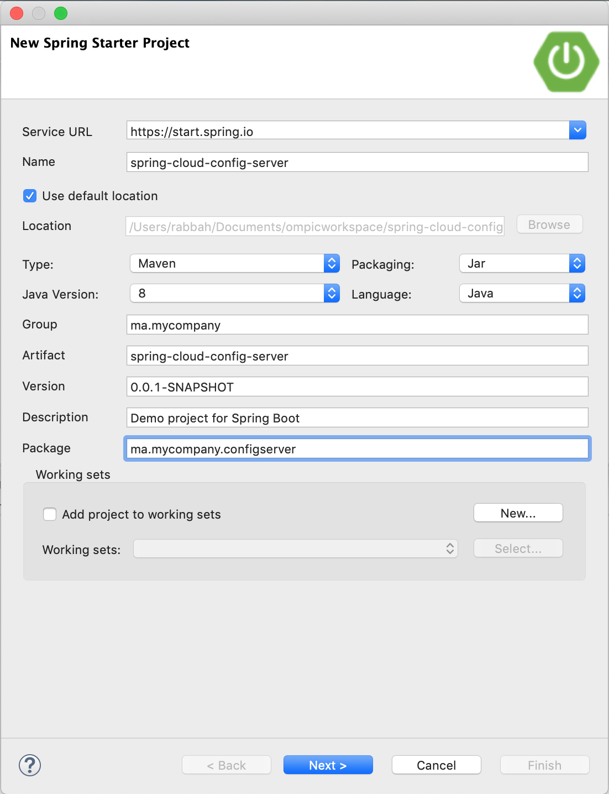
	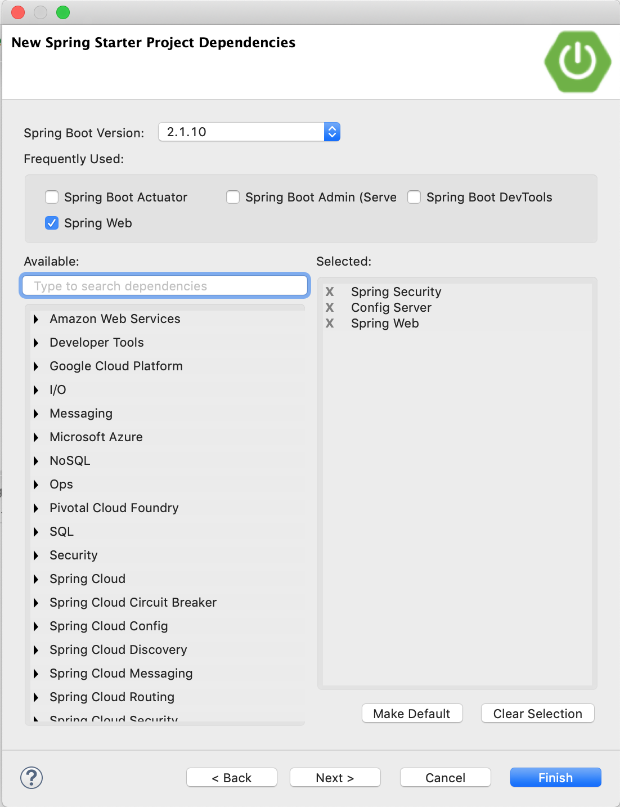
	
2. Ajoutez l'annotation `@EnableConfigServer` à votre class Principale:

	```java
	@SpringBootApplication
	@EnableConfigServer
	public class SpringCloudConfigServerApplication {
	
		public static void main(String[] args) {
			SpringApplication.run(SpringCloudConfigServerApplication.class, args);
		}
	
	}
	
	```
	
3. le serveur a besion de savoir le port sur lequel il va s'exécuter et le chemin vers le dossier git qui contient les différents fichiers de configuration, pour cela nous allons ajouter la configuration suivante au projet:
	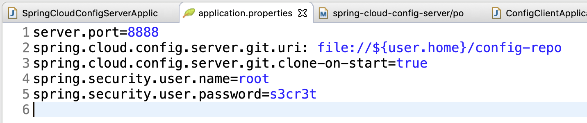
	
	```properties
	server.port=8888
	spring.cloud.config.server.git.uri=file://${user.home}/config-repo
	spring.cloud.config.server.git.clone-on-start=true
	spring.security.user.name=root
	spring.security.user.password=s3cr3t
	```
	
	Spring cloud configuration deserve les propriétés déclarées aux applications en se basant sur l'adéquation entre le nom du fichier et le nom de l'application et l'environnement active (dev, test, prod...) exemple:

	```
	/{application}/{profile}[/{label}]
	/{application}-{profile}.yml
	/{label}/{application}-{profile}.yml
	/{application}-{profile}.properties
	/{label}/{application}-{profile}.properties
	```
	
**Label rerésente la brach git utilisée** 

> Dans la partie suivante nous allons supposé qu'on va avoir une application cliente nommé **config-client** et on va supposer que nous avons deux environnements **production et development**

4. créer le dossier **config-repo** dans le répértoire de l'utilisateur système courant:

	```shell
		$ cd $HOME
		$ mkdir config-repo
		$ cd config-repo
		$ git init .
		$ echo 'user.role=Developer' > config-client-development.properties
		$ echo 'user.role=User'      > config-client-production.properties
		$ git add .
		$ git commit -m 'configuration initial du projet config-client'
	```
	
	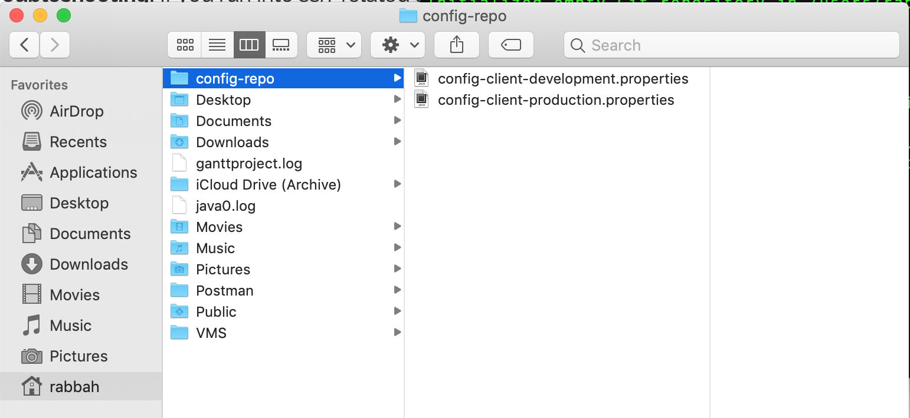
	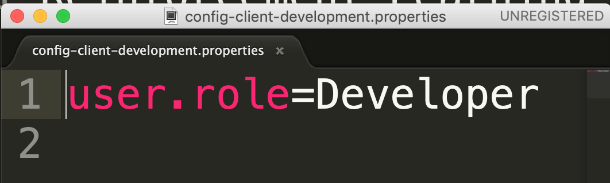
	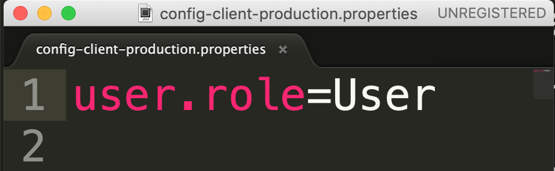
	
5. Lancer le serveur
	

6. Développant maintenant une application nommée **config-client** avec les starters suivants:
	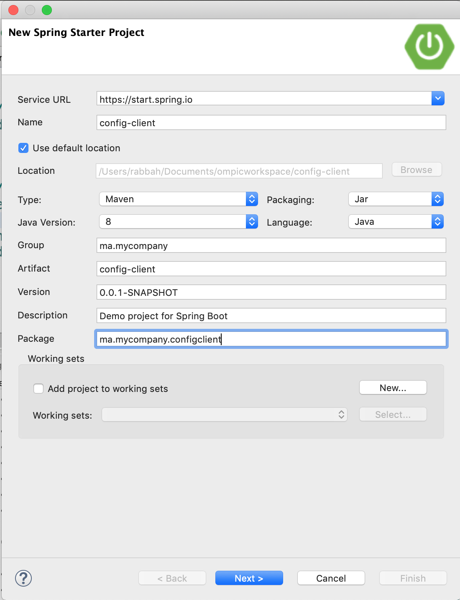
	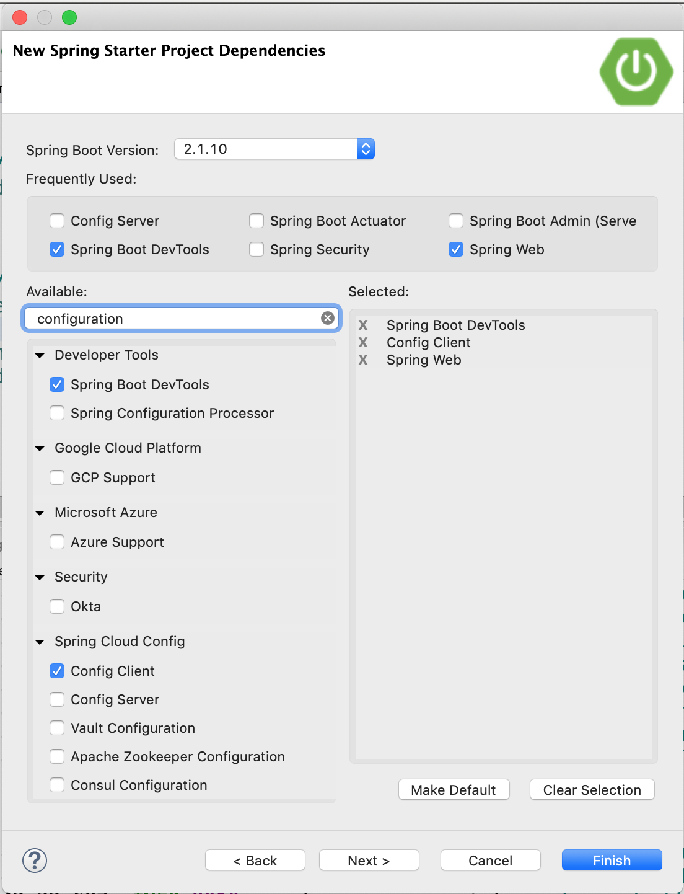

7. Changer la class principale comme suit:

	```java
	@SpringBootApplication
	@RestController
	public class ConfigClientApplication {
	
		@Value("${user.role}")
	    private String role;
		
		public static void main(String[] args) {
			SpringApplication.run(ConfigClientApplication.class, args);
		}
	
		@GetMapping("/")
		String index() {
			return "Le profil active est: " + role;
		}
	}
	```

8. Au niveau de l'application cliente créer le fichier bootstrap.properties qui contienderai la configuration initiale du projet
8. Au niveau de l'application il faut ajouter la configuration suivante pour la connecter au serveur et définir son nom:

	> spring.application.name=config-client
	spring.profiles.active=development
	spring.cloud.config.uri=http://localhost:8888
	spring.cloud.config.username=root
	spring.cloud.config.password=s3cr3t
	
9. Lancé l'application et tester:
	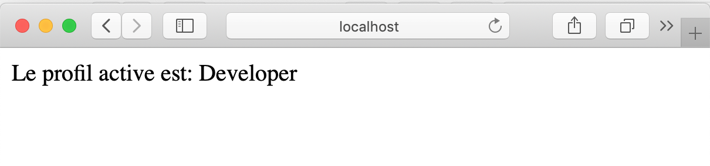

> Essayez de tester le changement au niveau de la configuration git et application.properties, Qu'est ce que vous remarquez?

10. Ajouter l'annotation `@RefreshScope` à votre Application cliente et ajouter le starter actuator, activer les EndPoints actuator via l'interface web au niveau du fichier `application.properties`, changez la valeur `user.role` dans le fichier `config-client-development.properties` faites un commit, puis faites appel à l'ENDPOINT (il faut utiliser POST) [http://localhost:8080/actuator/refresh](http://localhost:8080/actuator/refresh), qu'est ce que vous remarquez? 

	```java
	@SpringBootApplication
	@RestController
	@RefreshScope
	public class ConfigClientApplication {
	
		@Value("${user.role}")
	    private String role;
		
		public static void main(String[] args) {
			SpringApplication.run(ConfigClientApplication.class, args);
		}
	
		@GetMapping("/")
		String index() {
			return "Le profil active est: " + role;
		}
	}
	```
	```
	<dependency>
		<groupId>org.springframework.boot</groupId>
		<artifactId>spring-boot-starter-actuator</artifactId>
	</dependency>
	```
	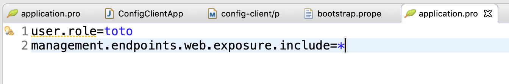
	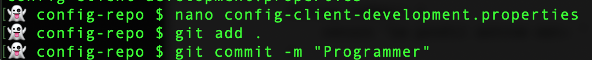
	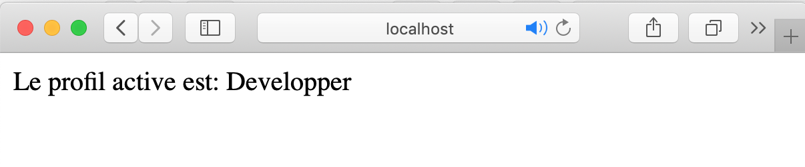
	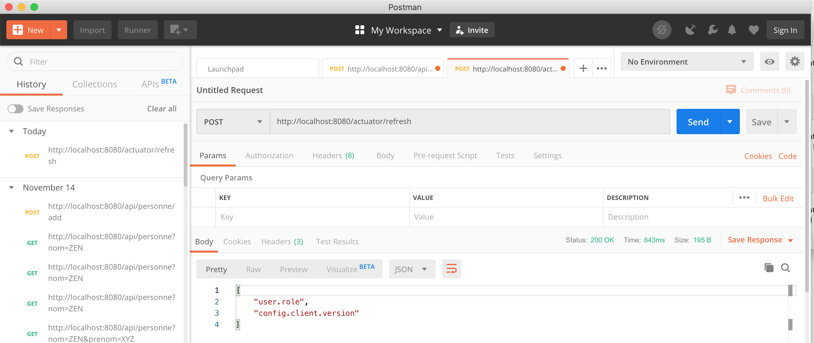
	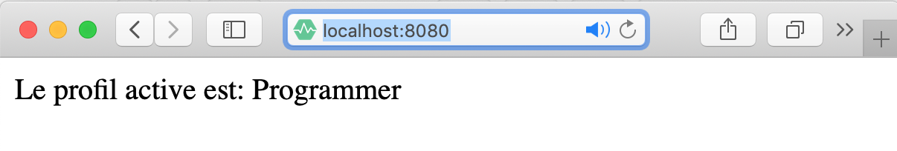
	
### EUREKA
1. Créez un nouveau projet Spring Boot nommé **my-eureka-server** comme suit:
	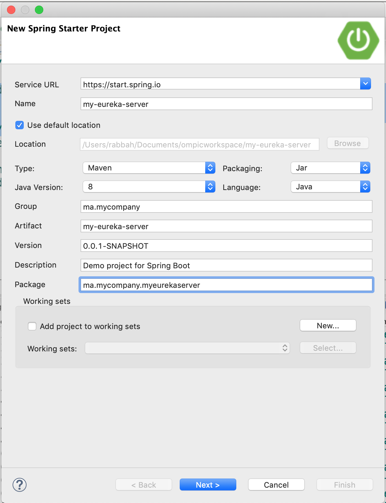
	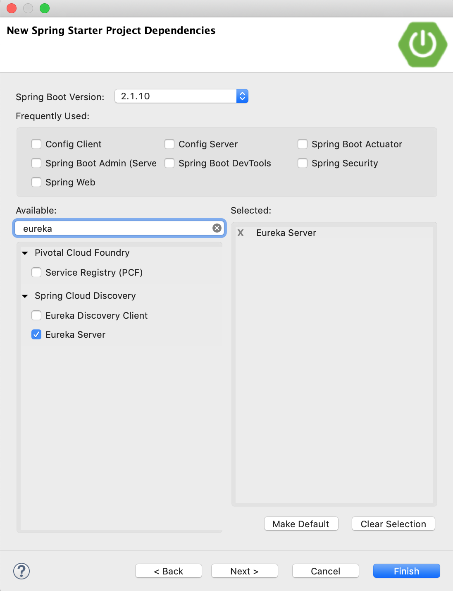
	
2. Au niveau de la class principale ajouter l'annotation suivante: `@EnableEurekaServer`
	
	```java
	@SpringBootApplication
	@EnableEurekaServer
	public class MyEurekaServerApplication {
	
	public static void main(String[] args) {
		SpringApplication.run(MyEurekaServerApplication.class, args);
	}
	
	}
	```

3. Il faut ensuite changer le fichier application.properties de tel sorte à avoir les valeurs suivantes:
	> server.port=8761
	
	> eureka.client.registerWithEureka=false
	
	> eureka.client.fetchRegistry=false
	
4. lancez le serveur et accéder à l'URL [http://localhost:8761](http://localhost:8761)
	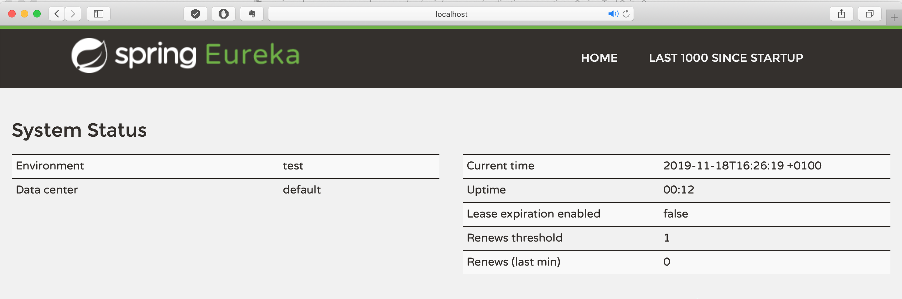

## Création de deux Microservices

### Eureka Client:

1. Créer un premier Microservice avec comme suit:
	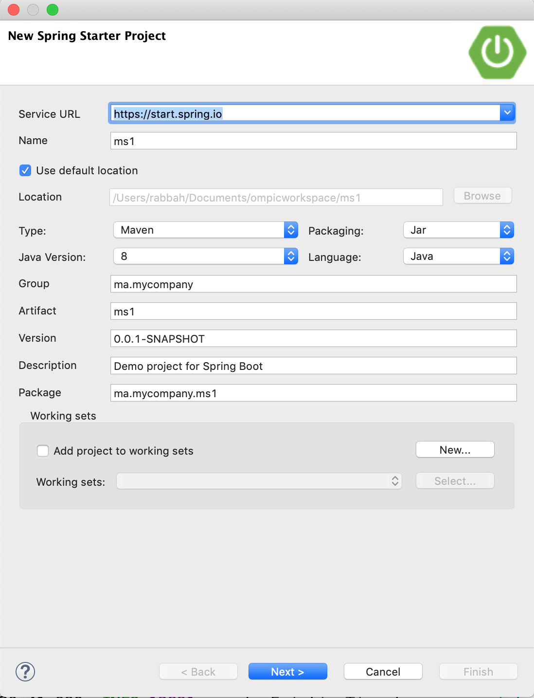
	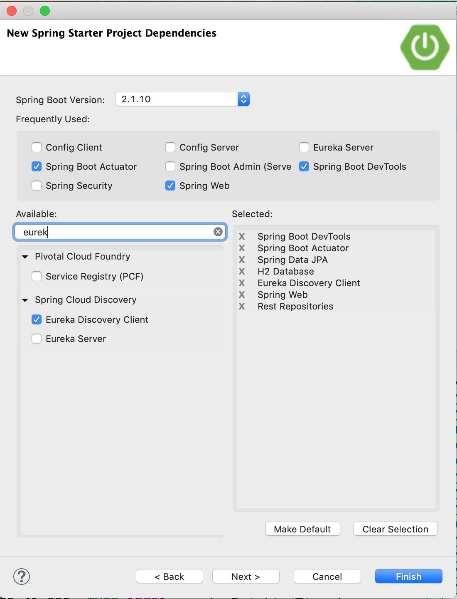
	
2. Créez un fichier **bootstrap.properties** et ajouter dedans les lignes suivantes:
	
	```properties
	spring.application.name=ms1
	spring.profiles.active=development
	server.port=0
	eureka.client.serviceUrl.defaultZone=${EUREKA_URI:http://localhost:8761/eureka}
	eureka.instance.preferIpAddress=true
	management.endpoints.web.exposure.include=*
	management.endpoint.health.show-details=always
	spring.h2.console.enabled=true
	```

3. Créer un REST CONTROLLER comme suit:
	
	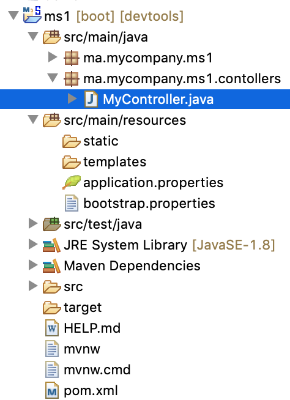
	
	```java
	import org.springframework.beans.factory.annotation.Autowired;
	import org.springframework.beans.factory.annotation.Value;
	import org.springframework.context.annotation.Lazy;
	import org.springframework.web.bind.annotation.GetMapping;
	import org.springframework.web.bind.annotation.RestController;
	
	import com.netflix.discovery.EurekaClient;
	
	@RestController
	public class MyController {
	
		@Autowired
	    @Lazy
	    private EurekaClient eurekaClient;
		
		@Value("${spring.application.name}")
	    private String appName;
		
		@GetMapping("/") String index() {
			return appName;
		}
	}
	```
	
4. Lancer l'application puis Re-visiter Eureka server:
	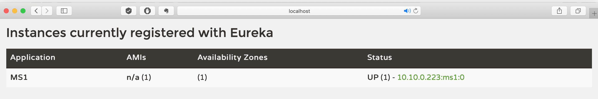

### Feign Client

Dans la suite nous allons créer une deuxième projet **ms2** identique à celui de **ms1** avec comme objectif que ms2 fait appel à ms1 en utilisant **Feign Client** qui est équivalent à **RestTemplate** mais plus adapté aux appels entre Microservices:

1. Créer un Microservice **ms2**:	
	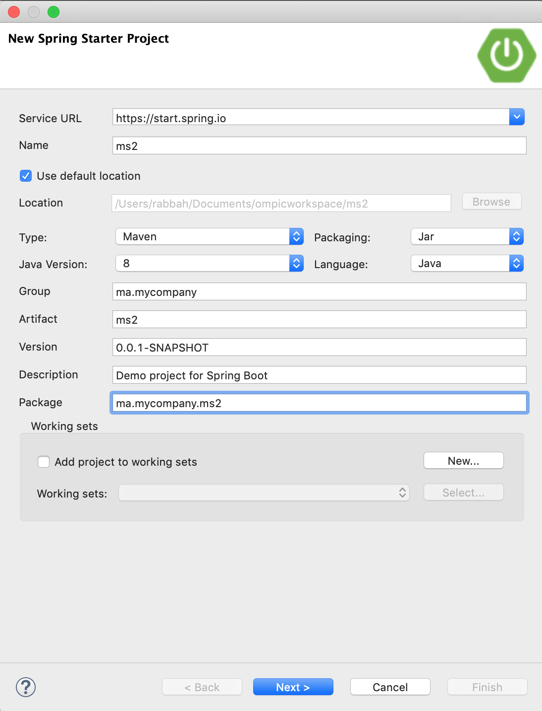
	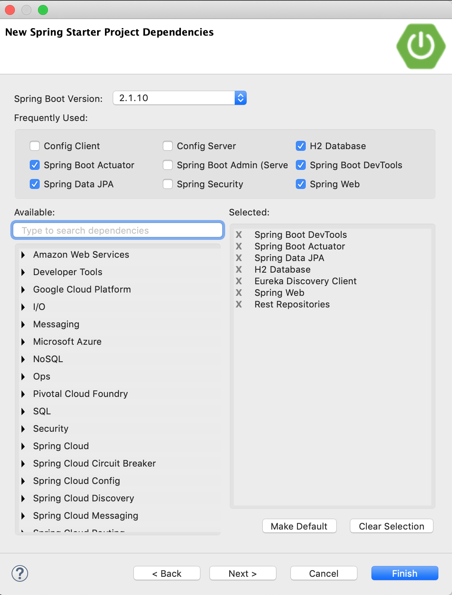
	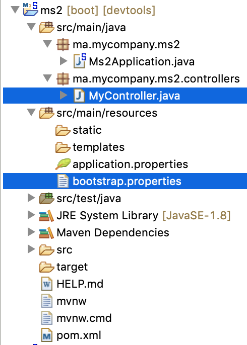
	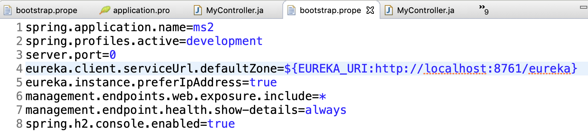

	```properties
	spring.application.name=ms2
	spring.profiles.active=development
	server.port=8080
	eureka.client.serviceUrl.defaultZone=${EUREKA_URI:http://localhost:8761/eureka}
	eureka.instance.preferIpAddress=true
	management.endpoints.web.exposure.include=*
	management.endpoint.health.show-details=always
	spring.h2.console.enabled=true
	```
	
2. Ajouter le starter Feign suivant au niveau du pom.xml:

	```xml
	<dependency>
	    <groupId>org.springframework.cloud</groupId>
	    <artifactId>spring-cloud-starter-openfeign</artifactId>
	</dependency>
	```
	
3. Ajouter un package nommé **clients** et dedans créer une interface nommé **Ms1Client** comme suit:
	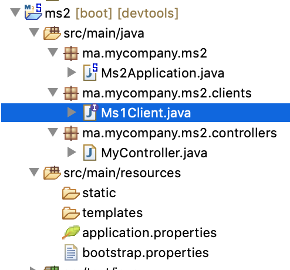
	
	```java
	import org.springframework.cloud.openfeign.FeignClient;
	import org.springframework.web.bind.annotation.GetMapping;
	
	@FeignClient("ms1")
	public interface Ms1Client {
	
		@GetMapping("/")
		String index();
	}
	```

4. Changer **MyController** avec le code suivant:

	```java
	package ma.mycompany.ms2.controllers;

	import org.springframework.beans.factory.annotation.Autowired;
	import org.springframework.cloud.openfeign.EnableFeignClients;
	import org.springframework.web.bind.annotation.GetMapping;
	import org.springframework.web.bind.annotation.RestController;
	
	import ma.mycompany.ms2.clients.Ms1Client;
	
	@EnableFeignClients(basePackages = {"ma.mycompany.ms2.clients","ma.mycompany.ms2.controllers"})
	@RestController
	public class MyController {
	
		@Autowired
	    private Ms1Client ms1Client;
		
		@GetMapping("/") String index() {
			return "I just called " + ms1Client.index();
		}
	}

	```
5. Exécuter le projet et accéder à [http://localhost:8080](http://localhost:8080)
	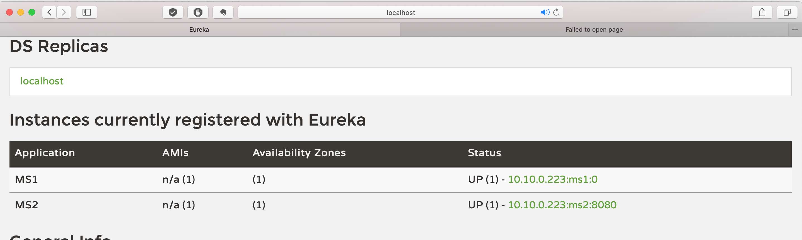
	
	
	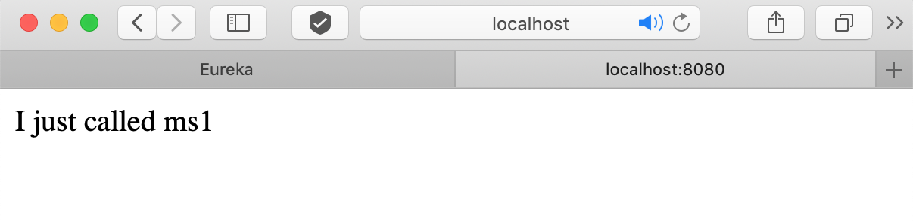

### RIBBON

Dans cette section nous allons load balancer le Microservice **ms1** en ajoutant Ribbon.

1. Ajouter le starter ribbon aux projets **MS1** et **MS2**

	```xml
	<dependency>
	    <groupId>org.springframework.cloud</groupId>
	    <artifactId>spring-cloud-starter-ribbon</artifactId>
	    <version>1.4.7.RELEASE</version>
	</dependency>
	```

2. Changer l'interface `Ms1Client` comme suit:

	```java
	package ma.mycompany.ms2.clients;

	import org.springframework.cloud.netflix.ribbon.RibbonClient;
	import org.springframework.cloud.openfeign.FeignClient;
	import org.springframework.web.bind.annotation.GetMapping;
	
	@FeignClient("ms1")
	@RibbonClient("ms1")
	public interface Ms1Client {
	
		@GetMapping("/")
		String index();
	}

	```

3. Ajouter au niveau du projet MS1 un package config, et dans ce package ajouter la class suivante:

	```java
	package ma.mycompany.ms1.config;
	
	import org.springframework.beans.factory.annotation.Autowired;
	import org.springframework.context.annotation.Bean;
	
	import com.netflix.client.config.IClientConfig;
	import com.netflix.loadbalancer.IPing;
	import com.netflix.loadbalancer.IRule;
	import com.netflix.loadbalancer.PingUrl;
	import com.netflix.loadbalancer.WeightedResponseTimeRule;
	
	public class RibbonConfiguration {
	
		@Autowired
	    IClientConfig ribbonClientConfig;
	 
	    @Bean
	    public IPing ribbonPing(IClientConfig config) {
	        return new PingUrl();
	    }
	 
	    @Bean
	    public IRule ribbonRule(IClientConfig config) {
	        return new WeightedResponseTimeRule();
	    }
	    
	}
	```


4. Lancez deux instances de MS1 et une instance de MS2

> Indication: java -jar target/ms1-0.0.1-SNAPSHOT.jar -Dserver.port=3333
> java -jar target/ms1-0.0.1-SNAPSHOT.jar -Dserver.port=4444

4. Faites appel à [http://localhost:8080](http://localhost:8080) pour que MS2 chaque fois va faire appel à une instance donnée.
	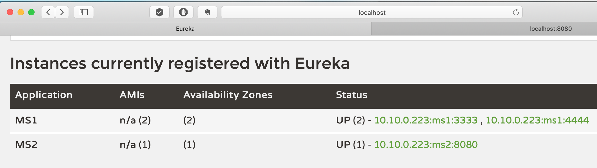
	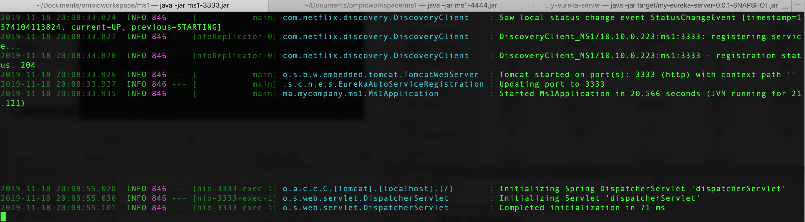
	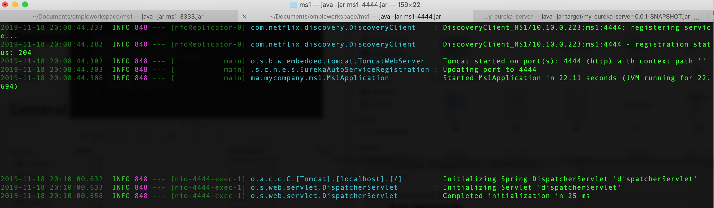
	
### Hystrix (Circuit breaker)

1. Ajoutez au niveau du projet **MS2** le starter hystrix:

	```xml
	<dependency>
	    <groupId>org.springframework.cloud</groupId>
	    <artifactId>spring-cloud-starter-hystrix</artifactId>
	    <version>1.4.7.RELEASE</version>
	</dependency>
	```
	
2. Ajouter au niveau de l'application principale l'annotation `@EnableCircuitBreaker` qui va permettre de scanner les implémenations du circuit breaker au niveau de votre projet:

	```java
	import org.springframework.boot.SpringApplication;
	import org.springframework.boot.autoconfigure.SpringBootApplication;
	import org.springframework.cloud.client.circuitbreaker.EnableCircuitBreaker;
	
	@SpringBootApplication
	@EnableCircuitBreaker
	public class Ms2Application {
	
		public static void main(String[] args) {
			SpringApplication.run(Ms2Application.class, args);
		}
	
	}
	```
	
3. Au niveau du package `clients` créer la class `Ms1ClientFallback` et implémenter l'interface `Ms1Client`:

	```java
	package ma.mycompany.ms2.clients;
	
	import org.springframework.stereotype.Component;
	
	@Component
	public class Ms1ClientFallback implements Ms1Client {
		@Override
		public String index() {
			return "MS1 Fallback service";
		}	
	}
	```

4. Par la suite changer l'interface `Ms1Client` comme suit: 

	```java
	package ma.mycompany.ms2.clients;
	
	import org.springframework.cloud.netflix.ribbon.RibbonClient;
	import org.springframework.cloud.openfeign.FeignClient;
	import org.springframework.web.bind.annotation.GetMapping;
	
	@FeignClient(name = "ms1", fallback = Ms1ClientFallback.class)
	@RibbonClient("ms1")
	public interface Ms1Client {
	
		@GetMapping("/")
		String index();
	}
	```
	
5. Enfin il faut activer au niveau de votre application.properties Hystrix pour Feing:
	> feign.hystrix.enabled=true
	
6. Relancer le Microservice 2 et tester l'application, que se passe-t-il quand le Microservice 1 est down?
	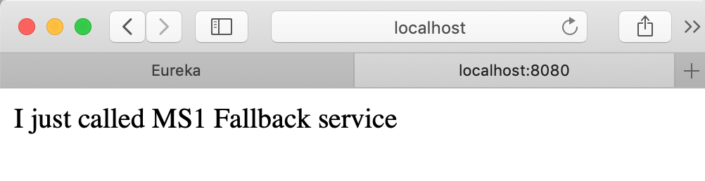

## Monitoring

1. Télécharger [ZIPKIN](https://search.maven.org/remote_content?g=io.zipkin&a=zipkin-server&v=LATEST&c=exec)
2. Exécuter le jar téléchargé: 
	`java -jar zipkin-server-X.X.X-exec.jar`
	
3. Accéder à l'URL [http://localhost:9411/zipkin/](http://localhost:9411/zipkin/)
	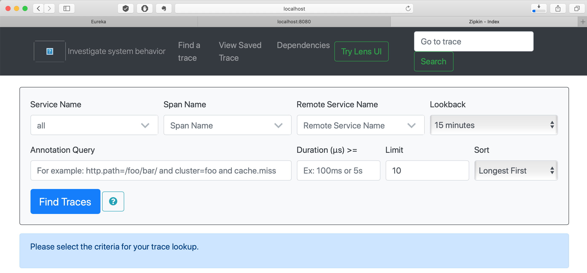
4. Ajouter les dépendances suivantes au niveau des deux Microservices créés:

	```xml
	<dependency>
	    <groupId>org.springframework.cloud</groupId>
	    <artifactId>spring-cloud-starter-zipkin</artifactId>
	</dependency>
	<dependency>
	    <groupId>org.springframework.cloud</groupId>
	    <artifactId>spring-cloud-starter-sleuth</artifactId>
	</dependency>
	```

5. Ajouter les propriétés suivantes au niveau des fichiers application.properties des deux MS:

	```properties
	spring.zipkin.base-url=http://localhost:9411
	spring.zipkin.sender.type=web
	spring.zipkin.service.name=${spring.application.name} 
	spring.sleuth.sampler.probability=1
	logging.level.org.springframework.cloud.sleuth=DEBUG
	spring.sleuth.enabled=true
	spring.zipkin.enabled=true
	```
	
6. Lancer les deux Microservice, et accéder à l'URL [http://localhost:8080](http://localhost:8080) pour que le MS2 fait appel au MS1.
7. Rafraîchissez l'interface de ZipKin
	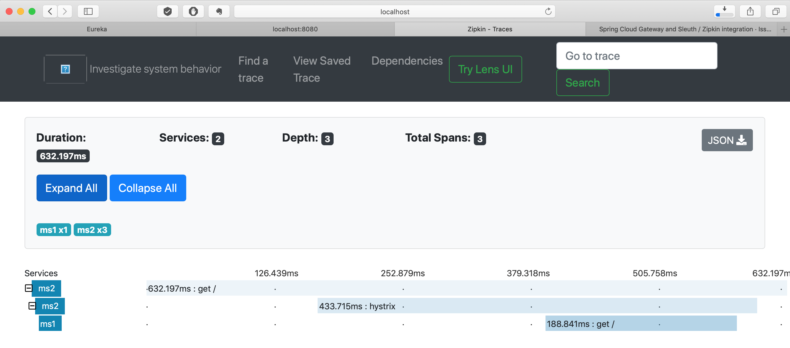

## Sécurité des Microservices

1. Télécharger [Keycloak Server](https://downloads.jboss.org/keycloak/8.0.0/keycloak-8.0.0.zip)
2. Dézipper le fichier keycloak-8.0.0.zip vers le dossier keycloak
3. Lancer keycloak:

	> cd kycloak/bin
	> ./standalone.sh -Djboss.socket.binding.port-offset=100

4. Accéder à l'URL [http://localhost:8180](http://localhost:8180)
5. Créer un utilisateur administrateur de Kycloak avec comme login: admin et comme mot de passe: admin
	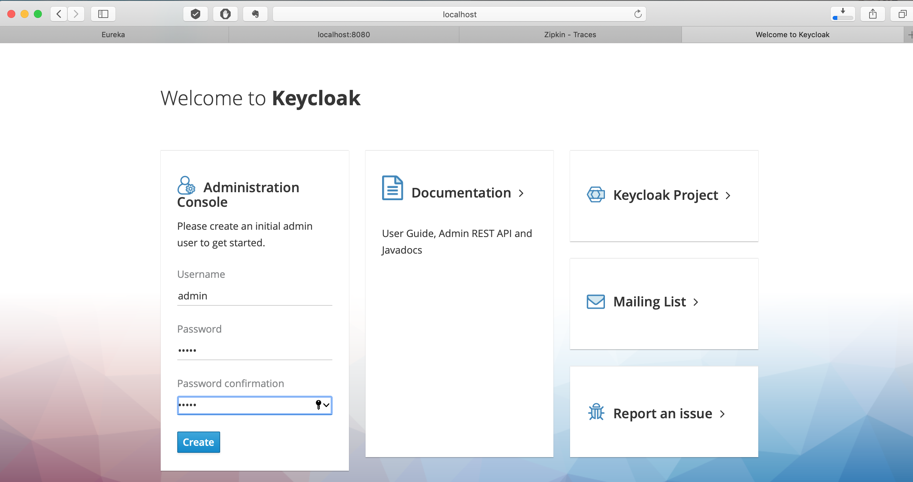
6. Logger à Keycloak et créer une nouvelle Realme nommé **SpringBootKeycloak**:
	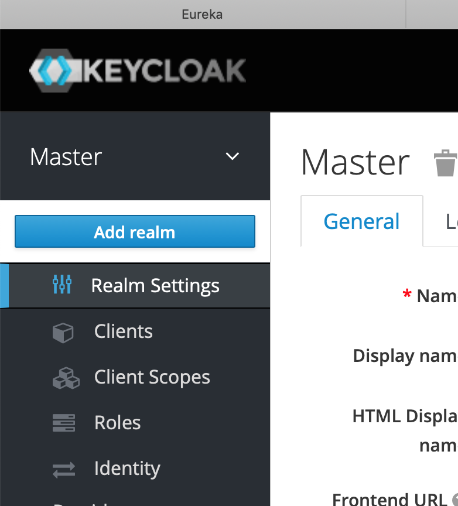
	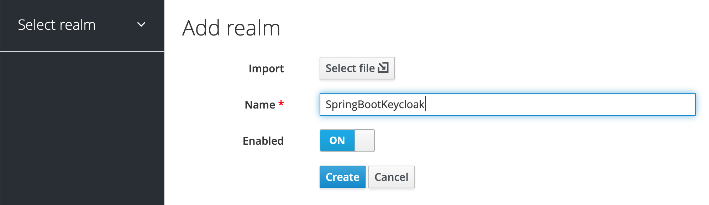
7. Créer un client comme suit:
	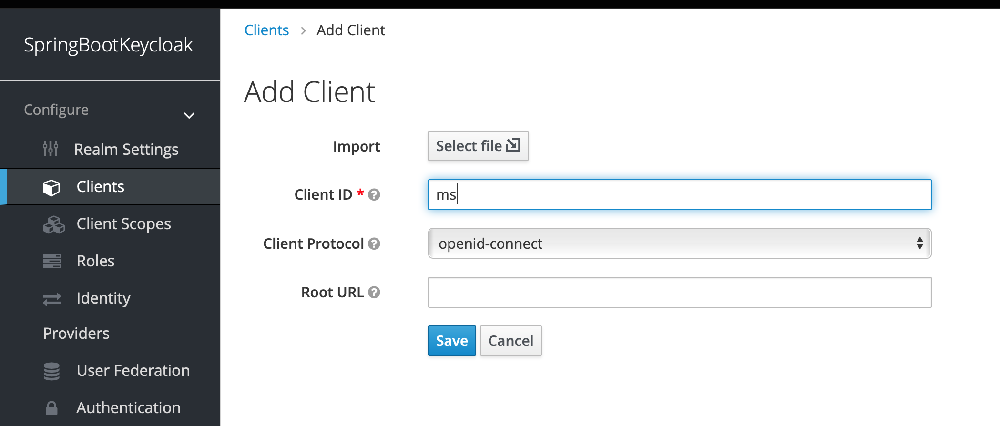
	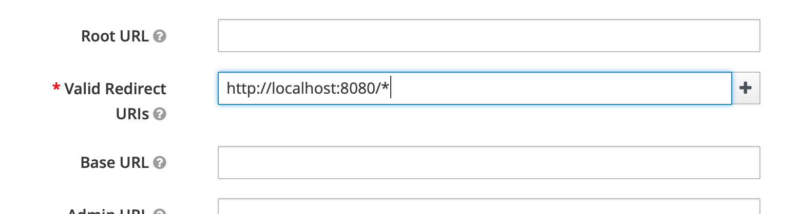
8. Créons deux rôles: ROLE_ADMIN et ROLE_USER
	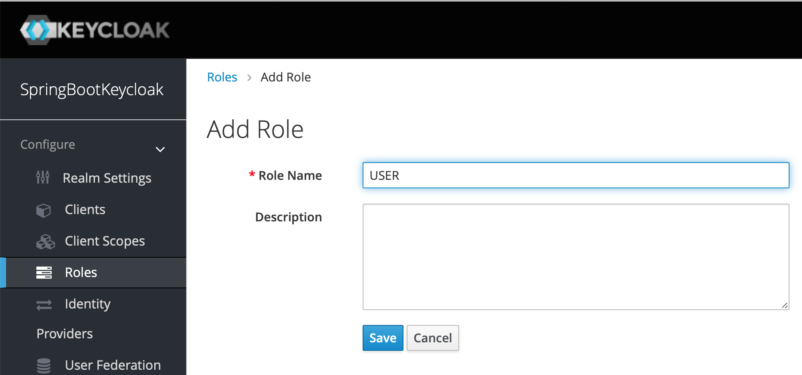
	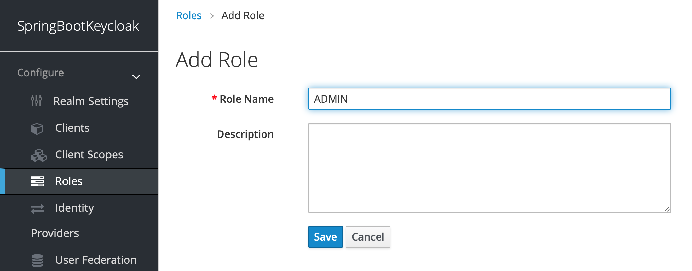
	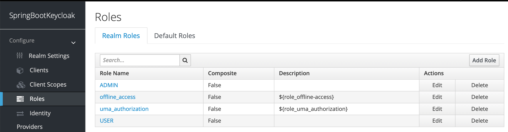
9. Créons deux utilisateurs user1 ayant comme rôle ROLE_ADMIN et user2 ayant comme rôle ROLE_USER leurs mots de passe respectivement user1 et user2.
	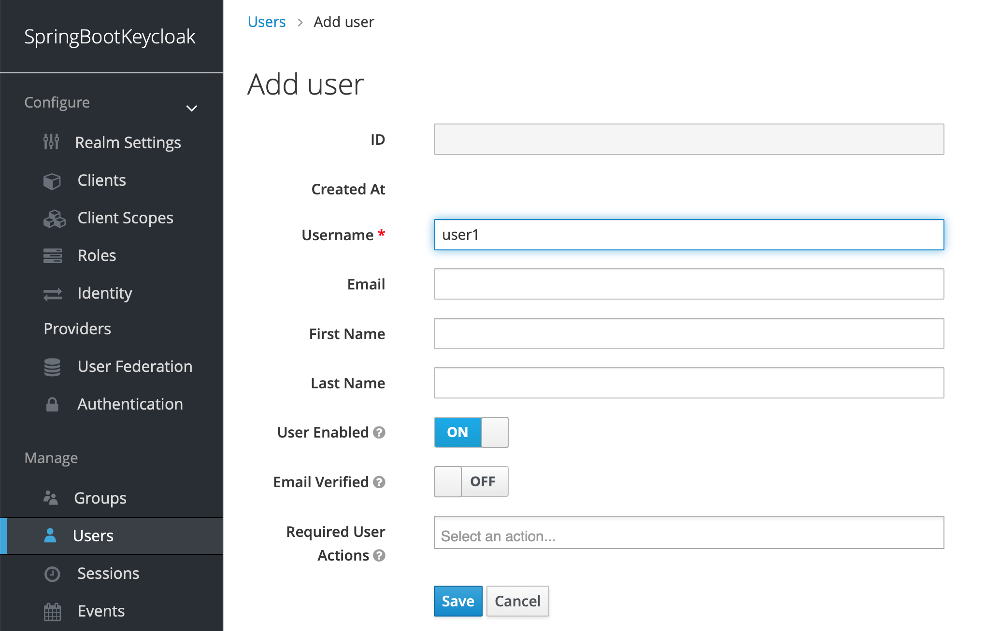
	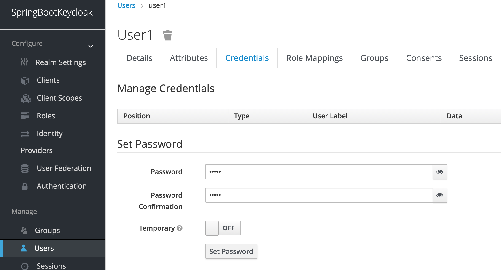
	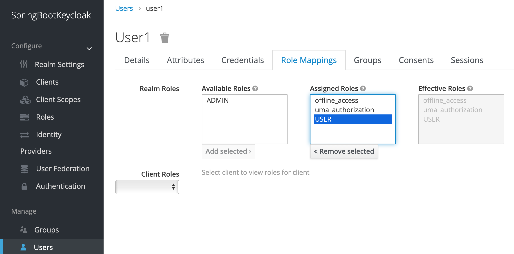
10. Ajoutant les dépendances suivantes au niveau des Microservices MS1 et MS2:

	```xml
	<dependency>
	    <groupId>org.keycloak</groupId>
	    <artifactId>keycloak-spring-boot-starter</artifactId>
	</dependency>
	```
	En plus au niveau du dependencyManagement il faut ajouter:
	
	```xml
	<dependency>
      <groupId>org.keycloak.bom</groupId>
      <artifactId>keycloak-adapter-bom</artifactId>
      <version>8.0.0</version>
      <type>pom</type>
      <scope>import</scope>
    </dependency>
	```
	
11. Ajouter la configuration suivante au niveau des fichiers application.properties des deux projets:

	```properties
	keycloak.auth-server-url=http://localhost:8180/auth
	keycloak.realm=SpringBootKeycloak
	keycloak.resource=ms
	keycloak.public-client=true
	keycloak.securityConstraints[0].authRoles[0]=USER
	# keycloak.securityConstraints[0].authRoles[1]=ADMIN
	keycloak.securityConstraints[0].securityCollections[0].name=Admin or user can access
	keycloak.security-constraints[0].securityCollections[0].patterns[0]=/*
	keycloak.cors=true
	```
	
12. Ajouter la class de configuration de kyecloak au nieau du package config des deux projet (éventuellement il faut créer ce package):

	```java
	package ma.mycompany.ms1.config;
	
	import org.keycloak.adapters.KeycloakDeployment;
	import org.keycloak.adapters.KeycloakDeploymentBuilder;
	import org.keycloak.adapters.spi.HttpFacade;
	import org.keycloak.adapters.springboot.KeycloakSpringBootConfigResolver;
	import org.keycloak.adapters.springboot.KeycloakSpringBootProperties;
	import org.springframework.context.annotation.Configuration;
	
	@Configuration
	public class MyKeycloakSpringBootConfigResolver extends KeycloakSpringBootConfigResolver {
	    private final KeycloakDeployment keycloakDeployment;
	
	    public MyKeycloakSpringBootConfigResolver(KeycloakSpringBootProperties properties) {
	        keycloakDeployment = KeycloakDeploymentBuilder.build(properties);
	    }
	
	    @Override
	    public KeycloakDeployment resolve(HttpFacade.Request facade) {
	        return keycloakDeployment;
	    }
	}

	```

13. Lancer les deux Microservices et essayer d'accéder à [http://localhost:8080](http://localhost:8080)
	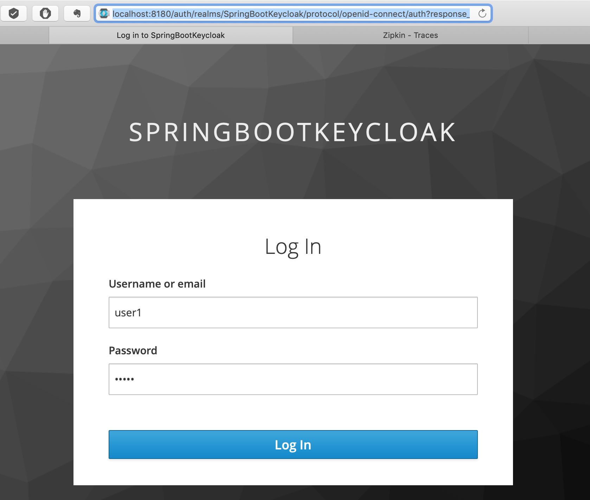
	
	
14. Changer le prot de MS1 vers 3333
15. Ouvrer Postman et indiquer les informations suivantes:
	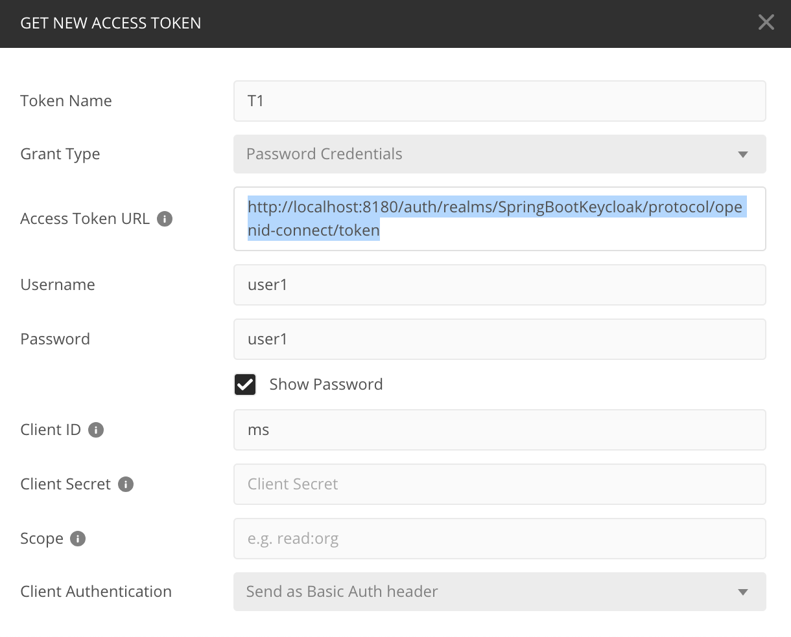
	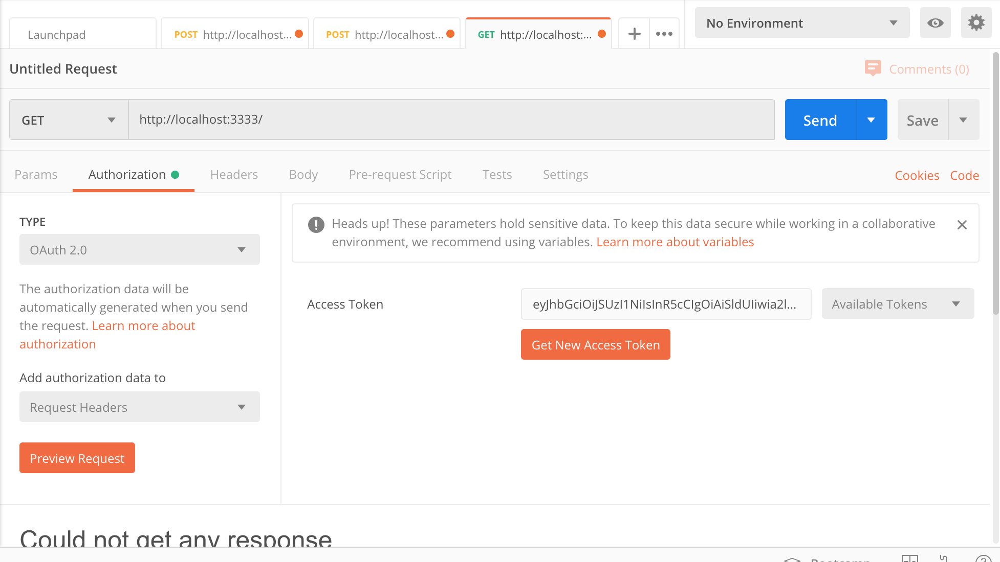
	**Remarque lien récupération token: http://localhost:8180/auth/realms/SpringBootKeycloak/protocol/openid-connect/token**
	
16. Envoyez la requête GET sur le lien [http://localhost:3333](http://localhost:3333) et vous allez obtenir la réponse souhaitée:
	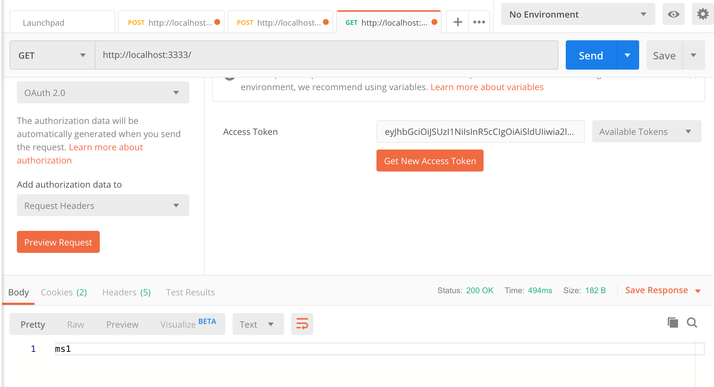

## SWAGGER

```
		<dependency>
			<groupId>io.springfox</groupId>
			<artifactId>springfox-swagger2</artifactId>
			<version>2.9.2</version>
		</dependency>
		
		<dependency>
			<groupId>io.springfox</groupId>
			<artifactId>springfox-swagger-ui</artifactId>
			<version>2.9.2</version>
		</dependency>
		
		@EnableSwagger2
		
		@Bean
		public Docket api() {
			return new Docket(DocumentationType.SWAGGER_2)
				.select()
				.apis(RequestHandlerSelectors.any())
				.paths(PathSelectors.any())
				.build();
		}
		
		private ApiInfo apiInfo() {
			return new ApiInfo("MS2 REST API",
				"L'API Public du Microservice 2 pour les Endpoints REST",
				"V2",
				"Terms of service",
				new springfox.documentation.service.Contact("RABBAH", "www.ompic.ma", "mrabbah@gmail.com"),
				"Licence Copyright", "API LICENCE URL", Collections.emptyList());
	}
		
```
	
	
	